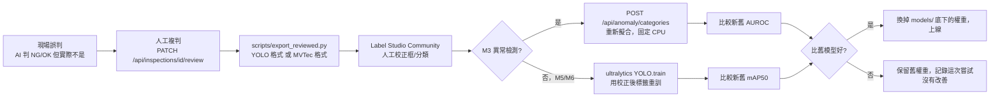

# vision-ai-demo — 台中製造業 AI 辨識 Demo

## 專案目標

本機執行的網頁 Demo，展示台中／中科製造業常見的 AI 影像辨識功能（工具機與精密機械、手工具、螺絲扣件、自行車零件、金屬加工/CNC、PCB 與電子、醫材與藥品包裝），作為應徵台中製造業 AI／ERP／MIS 工程師的作品集。之後會和 `manufacturing-erp`（ASP.NET Core + SQL Server，含品檢查詢）串接，所以每個模組的辨識結果都走共用的 JSON 結構，並寫入 SQLite 檢驗紀錄。

完整規劃見 [docs/manufacturing-ai-plan-prompt.md](docs/manufacturing-ai-plan-prompt.md)；套件與資料集授權查證見 [docs/licenses.md](docs/licenses.md)。

## 硬性規則

1. 只用免費工具；找不到免費方案的功能直接跳過，寫進 README「未納入功能」並說明原因，不寫假的 stub。
2. 核心功能完全離線執行（本機 Ollama 模型），不依賴 Gemini 配額；Gemini 免費層只當可選備援（`.env` 的 `LLM_ENGINE=ollama|gemini` 切換）。
3. 每個套件/模型/資料集安裝前先查官方來源確認版本與授權，寫進 `docs/licenses.md`，不憑記憶填版本號。
4. 非商用授權的資料集（如 MVTec AD 的 CC BY-NC-SA）在 README 註明「僅供學習/作品集展示」。
5. 分階段執行，每個 Phase 結束回報實際測試結果，等確認再進下一階段。
6. 測試結果不可捏造：準確率/推論時間/截圖只記錄實際跑出的數字，沒跑過就寫「未測試」。
7. 大檔（模型權重、資料集、訓練輸出、SQLite）放 `models/`、`data/`、`runs/`，已加進 `.gitignore`。commit 前用 grep 掃過沒有 API key。
8. Apple Silicon Mac：PyTorch 用 `mps`，不支援時自動退回 `cpu`。
9. Python 3.11（Anomalib 等套件需要 ≥3.10）。

## 技術決策與理由（Phase 1）

- **後端：FastAPI + Uvicorn**，Python 3.11（`uv venv --python 3.11`，系統原生只有 3.9/3.10/3.13/3.14，改用 uv 裝 3.11）。
- **LLM 抽象層**（[backend/core/llm.py](backend/core/llm.py)）：`LLM_ENGINE=ollama`（預設）或 `gemini`（備援），模組只呼叫 `generate_json(prompt, image)`，不需要知道底層引擎。
  - Ollama 預設模型 `qwen3.5:9b`（6.6GB、Apache-2.0，2026-09 查證版本，多模態）。`qwen3-vl:8b` 為備選。`qwen3.6`／`qwen3.8` 最小為 27B，16GB Mac 跑不動，不採用。
  - `ollama.Client.chat(..., format="json", think=False)` 強制輸出 JSON，關閉思考模式減少延遲；找不到模型或連不上 Ollama 時回傳清楚的錯誤訊息（提示 `ollama pull` 或 `ollama serve`）。
  - JSON 解析失敗會回傳 502 錯誤，不會硬塞假資料掩蓋問題。
- **共用回應格式**（[backend/core/schemas.py](backend/core/schemas.py)）：`{module, verdict, items, annotated_image, engine, elapsed_ms, inspection_id}`，所有模組一致，方便之後 ERP 串接。
- **檢驗紀錄**（[backend/core/inspection_log.py](backend/core/inspection_log.py)）：SQLite（`data/inspections.db`，不進版控），每次辨識寫一筆，`GET /api/inspections?module=&verdict=&date_from=&date_to=` 查詢，`/api/inspections/export.csv` 匯出（含 BOM，Excel 開啟中文不亂碼）。Phase 9 起新增追溯欄位、原圖/標註圖存檔（`data/images/`）、人工複判、看板統計，見下方「技術決策與理由（Phase 9）」。
- **目錄結構**：`backend/core/`（共用工具）、`backend/modules/<模組>/{router.py,service.py}`（每個模組獨立）、`tests/`（pytest，測試圖由 `tests/samples/make_samples.py` 程式生成，不依賴外部授權圖片，不進版控）。
- **M9 開放式辨識**：原「街景辨識」改為現場照片辨識，prompt 改成機台/工具/零件/標示/安全觀察情境，新增「可見文字」「安全觀察」欄位。
- **M4 製造文件結構化**：Phase 1 沿用 Tesseract 兩段式 + 端到端兩種模式（欄位命名改成工單/出貨單/檢驗報告情境），改走 LLM 抽象層。Phase 4 會換成 RapidOCR + Pydantic schema（理由見下方套件決策）。
- **套件版本鎖定不用 PaddleOCR**：用 `uv pip compile` 實測，Python 3.11 環境下 `paddlex` 要求 `numpy<2.4`，會把 `paddleocr` 拖回 2.10.0 舊版且 macOS 只有 CPU 版；改用 RapidOCR（同樣是 PP-OCR 模型的 ONNX 版，Apache-2.0，相依乾淨）。
- **測試策略**：單元測試（`pytest`，預設執行）用假的 `core.llm.generate_json` / `modules.safety.service._detect_persons` 隔離 LLM 與 YOLO，只驗證 API 契約、SQLite 寫入、錯誤處理、業務邏輯（GS1 解析、效期判斷、多邊形入侵判斷）；`-m live` 標記的測試會真的呼叫本機 Ollama／YOLO，驗證真實延遲與準確度，預設不跑。

## 技術決策與理由（Phase 2）

- **M1 追溯碼（`backend/modules/codes/`）**：`zxing-cpp` 解碼，GS1 條碼的 `barcode.text` 預設就是 `(AI)值(AI)值...` 的人類可讀格式（`TextMode.HRI`），不需要自己處理 FNC1 分隔符號；(17) 效期用 GS1 規則（YY 00-50→20xx、51-99→19xx，DD=00 代表當月最後一天）換算，已過期 NG、30 天內到期標「即將到期」（不算 NG）。
- **M2 計數（`backend/modules/measure/`）**：一開始用「distance transform 整塊閾值」分割相黏零件失敗（兩顆相黏的圓被當成一顆，面積是單顆的 2 倍），改用「距離變換的局部極大值當種子點」才能正確分離——原因是整塊閾值下，兩顆圓重疊處的距離值仍高於閾值，前景還是連通的；局部極大值抓的是各自的中心峰值，不受這個影響。
- **M2 量測**：ArUco 標記四角做 homography 透視校正，把整張圖攤平成固定 px/mm 的正視圖再量測。實測系統性誤差約 0.3-0.6mm（50mm 零件上約 1%），來源是 ArUco 邊界像素化與二值化邊緣效應；預設公差從原規劃的 0.5mm 調整為 1.0mm 較務實。
- **M5 危險區域入侵（`backend/modules/safety/`）**：YOLO 選用 `yolo11n.pt`（成熟穩定、COCO person 類別）而非同批發布的 `yolo26n.pt`（2026-09 才發布的最新架構，尚無足夠驗證案例）；人員判定用「邊界框底邊中點（腳底參考點）」是否落在使用者畫的多邊形內（`cv2.pointPolygonTest`），而非用整個框判斷，理由是危險區域通常畫在地面，用腳底位置比整個人形框更符合實際「站在哪裡」的語意。Phase 2 只做單張圖片，短影片逐幀抽樣留到 Phase 5 跟 PPE 一起做。
- **live 測試用真實照片**：M5 的自動偵測準確度用合成圖驗證不出意義（YOLO 認的是真人特徵），改抓 Wikimedia Commons 的 CC BY 2.0 授權工廠照片（`tests/live_samples/`，不進版控，來源見 `docs/licenses.md`），95.1% 信心度正確偵測到人。

## 技術決策與理由（Phase 3）

- **M3 異常檢測（`backend/modules/anomaly/`）**：Anomalib PatchCore，非監督式——只用良品照片擬合一個特徵記憶庫（memory bank），不需要 NG 樣本，這正對應工廠現場「良品多、NG 樣本稀少」的真實情境。骨幹網路用預設的 `wide_resnet50_2`（ImageNet 預訓練，Apache-2.0，只做前向推論抽特徵，不重新訓練）。
- **PatchCore 固定用 CPU，不用 MPS**：實測 MPS 反而比 CPU 慢很多，原因是 coreset 貪婪演算法逐元素呼叫 `.item()` 觸發 GPU 同步（見已知限制、Phase 3 測試紀錄的除錯過程）。這跟 Phase 0 原本規劃的「MPS 優先，不支援才退回 CPU」不同——MPS 是支援的，只是這個特定演算法在 MPS 上特別慢，所以固定用 CPU。
- **訓練與推論分離**：`scripts/train_anomaly.py` 離線擬合＋用 `anomalib.deploy.ExportType.TORCH` 匯出成 `TorchInferencer` 可直接載入的 `.pt`（包好 pre-processor 與門檻值），服務層（`backend/modules/anomaly/service.py`）只做推論、不依賴完整的 Lightning 訓練環境概念，載入後常駐記憶體、依 category 分開快取。
- **熱力圖標註**：`anomaly_map` 正規化到 0-1 後用 `cv2.COLORMAP_JET` 上色疊在原圖上（紅＝異常機率高），跟其他模組共用的 `annotated_image` 欄位格式一致。
- **信任本機權重**：anomalib 的 `TorchInferencer` 預設拒絕 unpickle 權重檔（防惡意程式碼），只在載入自己訓練產生的權重時設定 `TRUST_REMOTE_CODE=1`，並在程式碼註解寫清楚為什麼這樣做是安全的（不是無條件關掉資安檢查）。

## 技術決策與理由（Phase 4）

- **M4 換成 RapidOCR（`backend/core/ocr.py`）**：取代 Phase 1-3 暫時沿用的 Tesseract。實測工單號 `WO-2026-0915`，Tesseract 會誤讀成 `WO-2026-0215`（數字 9→2），RapidOCR 讀得完全正確——這不是理論上的優勢，是同一張測試圖跑出來的真實差異。Tesseract 保留成 `mode=tesseract` 比較選項（`backend/core/tesseract_ocr.py`），不是直接砍掉。
- **表格結構辨識（`RapidTable`）**：出貨單的品項表格用 `rapid-table`（`slanet-plus.onnx`）解析成 HTML 表格，當作額外上下文餵給 LLM，幫助多列品項的解析更準；表格辨識失敗時退回純文字，不讓整個請求掛掉。`rapid-layout` 裝了但這個 Phase 沒用到（目前三種文件都是單一區塊版面，不需要版面分析；留給之後 M7 銘牌/複雜版面用）。
- **嚴格 schema（`backend/schemas/documents.py`）**：工單／出貨單／進料檢驗報告三種文件定義 Pydantic model，LLM 回傳的 JSON 一律過 `model_validate()`；驗證失敗回傳 `_驗證錯誤`（逐欄位列出問題），不會用預設值把錯誤蓋過去。報價單／名片／其他文件類型沿用原本的自由格式（不硬套 schema，因為欄位天生因文件而異）。
- **數字來源核對（防止 LLM 捏造數字）**：所有數字欄位都用 `{值, 原文片段}` 的格式，LLM 除了給數字還要附上「這是從原文哪裡抄的」；service 層（`_annotate_source_verification`）拿這段原文片段去對 OCR 真實文字做子字串比對，比對得到標「OK」，比對不到標「可疑：原文中找不到這段文字，數字可能是 LLM 捏造的」——這個檢查完全不靠 LLM 自己說了算。端到端模式沒有獨立 OCR 文字可以核對，誠實標記「無法驗證」，不假裝驗證過。
- **文件類型判斷分兩段 LLM 呼叫**：先分類（`文件類型`），再依分類結果決定要不要套嚴格 schema、要用哪個 schema 專用 prompt。兩段式比一段式多一次 LLM 呼叫的延遲，換來的是每種文件類型可以給非常明確的目標 JSON 結構範例，而不是要 LLM 自己猜欄位名稱。

## 技術決策與理由（Phase 5）

- **M6 PCB 瑕疵偵測（`backend/modules/defect/`）**：監督式 YOLO11n，跟 M3（PatchCore，非監督）刻意互補——M3 不需要 NG 樣本但只能說「哪裡異常」，M6 需要標註過的 NG 樣本（DeepPCB）但能講出「是哪一種瑕疵」（斷路/短路/缺口/毛刺/多餘銅箔/針孔）。
- **DeepPCB 官方沒有切分清單，自己切**：官方 README 只說「1000 張當訓練集，其餘當測試集」，沒附清單。`scripts/prepare_deeppcb.py` 用固定亂數種子（42）切 1000/250/250，可重現，並在程式註解與文件裡誠實寫「不是官方切分」。
- **MPS 訓練 YOLO 沒有 M3 PatchCore 那個坑**：M3 的 coreset 演算法在 MPS 上因逐元素 `.item()` 同步而極慢；YOLO 的訓練是標準卷積+反向傳播，MPS 支援良好，實測 M1 Pro 上 1 epoch（1000 張、batch16）約 47 秒，PCB 模型 41 epoch（early stop）只花 32 分鐘。這跟 M3 的結論不衝突——「MPS 對某些特定演算法很慢」不等於「MPS 對深度學習訓練普遍很慢」。
- **ultralytics 的 `project` 路徑陷阱（真的踩到，見下方測試紀錄）**：`project='models/defect'` 這種相對路徑會被 ultralytics 全域設定的 `runs_dir` 加上前綴，實際存到 `runs/detect/models/defect/...`，不是我以為的 `models/defect/...`。PPE 訓練改用絕對路徑 `project='/Users/.../models/ppe'` 避開這個陷阱。
- **M5 PPE 只有兩類（helmet/head）**：Hard Hat Workers 資料集本身沒有反光背心類別，這是 Phase 0 就查證過的資料集限制，不是這個 Phase 漏做；沿用資料集自帶的 Train/Test 切分（不像 DeepPCB 要自己切）。

## 技術決策與理由（Phase 6）

- **先測 OCR 再決定要不要自己做（照規劃的順序）**：七段顯示器實測 RapidOCR 完全偵測不到文字（`text detection result is empty`），Tesseract 把數字亂猜成中文字（`世紀二`）。兩個都不能用，才照規劃改用 OpenCV 逐段判讀（`backend/core/seven_segment.py`），不是預設就寫死走 OpenCV。
- **七段判讀不用膨脹黏合**：一開始用膨脹（dilate）讓斷開的線段黏成一個連通元件，結果反而把小數點跟隔壁數字黏在一起、也把緊致邊界框撐大到取樣點對不準線段位置。改成不做任何形態學處理，直接對原始二值圖做連通元件分析——只要線段有在轉角共用像素（正常畫法本來就是），一個數字自然就是一個連通元件，小數點因為高度矮很多會自然分開成獨立元件，不需要膨脹。
- **數字「1」要特判**：「1」只有右側兩條線段，緊致邊界框寬度遠小於其他數字，若照 7 個比例取樣點去取樣，取樣窗口會意外全部落在同一條線上而誤判成「8」。用「寬度明顯小於其他數字寬度中位數」直接特判成 1，不跑一般的七段比對。
- **指針錶角度慣例選 atan2(dy,dx)**：0 度＝3 點鐘方向，順時針遞增（因為圖片座標 y 軸向下，這剛好是最自然、不用額外轉換正負號的方向）。圓心找不到時要求使用者手動輸入正規化座標，不硬猜。
- **指針角度換算成讀值抓到一個真實 bug（不是預想到才防的）**：指針剛好落在 `min_angle` 邊界附近（134.7° vs min_angle=135°，只差 0.3° 的量測雜訊），原本的邏輯把「角度略小於 min_angle」一律當成「指針繞了一整圈從另一端過來」，讀值從該接近 0 跳成 100。改成同時算「角度」跟「角度+360」兩種解讀，取夾範圍前比例離 [0,1] 較近的那個，邊界雜訊就不會被誤判成整整繞一圈。這個 bug 是實際測試邊界情況才發現的，寫了對應的 `test_gauge_boundary_noise_does_not_wrap_to_opposite_end` 測試釘住，不會再退化。
- **銘牌沿用 M4 的單段 LLM 呼叫模式**（不是兩段式）：因為銘牌不需要先判斷文件類型，直接一次 OCR 文字→固定 schema（`backend/schemas/nameplate.py`）結構化，比 M4 簡單。

## 技術決策與理由（Phase 7）

- **M8-1 包裝檢核重用 M1 的條碼解析**：`backend/modules/codes/service.py` 的 `describe_barcode()`（原本是模組內部函式 `_describe_barcode`，這次改成公開函式給 M8 匯入重用，不重寫一份重複邏輯）解出 GS1 條碼的批號/效期，再用 RapidOCR+LLM 讀印刷文字上的批號/效期，兩邊比對。這正是 GMP 追溯的真實情境：條碼跟印刷文字對不上，代表包裝可能印錯或貼錯條碼，比單獨檢查條碼或單獨檢查印刷文字更能抓到真實瑕疵。
- **比對邏輯明確區分「不一致」跟「沒辦法比對」**：兩邊有一邊沒讀到資料時回傳 `None`（沒辦法比對），不會被當成「不一致」硬判 NG——OCR 讀不到印刷文字很常見（印刷模糊、被遮擋），不該因為讀不到就誤報瑕疵。
- **M8-2 選 PneumoniaMNIST 而非其他 MedMNIST 子集**：規劃就指定用這個資料集，CC BY 4.0（DermaMNIST 是 CC BY-NC 4.0，不能用）；28x28 灰階、二元分類，CPU 15 epoch 只要 19.4 秒，適合當「教學展示」而不是要花很久訓練的正式模型。
- **開發中抓到訓練集類別不平衡的真實 bug**：PneumoniaMNIST 官方訓練集是 normal 1214 張、pneumonia 3494 張（約 1:2.9），第一版沒處理不平衡，訓練出來的模型對 normal 的召回率只有 55.6%（234 張正常樣本裡 104 張被誤判成肺炎）——這是拿真實照片測試才發現的，不是憑空猜的。加上 `pos_weight`（`BCEWithLogitsLoss` 內建的類別權重參數）調降多數類別（pneumonia）的損失權重後，normal 召回率提升到 74.8%，整體測試集 ACC 從 0.8285 提升到 0.8862、AUC 從 0.9284 提升到 0.9346。`scripts/train_medmnist.py` 現在會把 normal/pneumonia 各自的召回率都寫進 `metrics.json`，不是只看整體 ACC 掩蓋類別偏差。
- **警語要在三個地方都出現**：API 回應的 `item["警語"]`、前端分頁的紅色粗體警語文字、`docs/licenses.md` 的資料集用途說明，三處都寫「僅供技術展示，非醫療診斷用途」，不是只在某一處交代就算了。
- **這個模組的 `verdict` 一律回傳 INFO**：不是 OK/NG，因為這不是品檢判斷，用 OK/NG 容易被誤讀成「AI 判定這個人健康/生病」的結論性語氣。

## 技術決策與理由（Phase 8）

- **截圖產生工具選 Playwright，不是既有的瀏覽器自動化工具**：試過三種方案都不行——`mcp__claude-in-chrome__computer` 的 `save_to_disk` 參數其實不存在（呼叫會被靜默忽略，截圖存不到任何找得到的地方，查了實際 fetch 到的 tool schema 才確認）；內建瀏覽器（`mcp__Claude_Browser__*`）整組工具沒有檔案上傳功能，跟專案 CLAUDE.md 原本記載的限制一致；`mcp__computer-use__*` 全螢幕操作對瀏覽器只給「read」權限（不能點擊），且 `app_list_windows` 抓到的是使用者自己在瀏覽的無關視窗，抓不到自動化分頁。改裝 Playwright（純 Python，另開一個獨立 headless Chromium）後可以直接 `page.set_input_files()` 上傳、`page.screenshot(path=...)` 存檔，完全不受任何 GUI 自動化工具的權限分級限制。只在 venv 額外裝，不進 `requirements.txt`（一次性文件用工具，不是 app 執行期相依）。
- **M5 危險區域截圖踩到 canvas 座標的真實 bug**：第一次產生的 `06_safety.png` 危險區域判定是 `false`（沒有示範到更有意義的 NG 案例），畫出來的多邊形視覺上只有一條線、不是封閉四邊形。用 `page.mouse.click(絕對頁面座標)` 點擊 canvas 下半部的兩個點時，那兩個點的 y 座標已經超出瀏覽器 viewport 高度（900px）——canvas 圖片高度撐開了整個頁面，下半部的點落在「需要捲動才看得到」的範圍，但 `page.mouse.click` 是對 viewport 座標直接派發滑鼠事件，不會像真人滑鼠一樣先捲動視窗，所以那兩次點擊完全沒有命中 canvas，只有前兩個點成功記錄，畫出的只是一條線而非四邊形。改用 `locator.click(position=...)`（相對 canvas 左上角的座標，Playwright 會自動先把該元素捲進可視範圍再點擊）後，4 個頂點都正確記錄，重新產生的截圖正確顯示「危險區域: true」與半透明紅色覆蓋區。這是先看到截圖內容不合預期（`危險區域: false` 是意外結果，不是預期中的示範案例），照著「Surprise is signal」去查才抓到的，不是預先猜到才防的。
- **README「未納入功能」直接引用規劃文件原文**：`docs/manufacturing-ai-plan-prompt.md` 已經寫好每一項未納入功能的具體原因（付費軟體、需要硬體、資料集授權不明、非影像辨識範疇等），沒有重新編造理由，同時補上一項規劃文件裡沒單獨列出但實際發生過的案例：M6 原規劃第一選項 NEU-DET 資料集在 Phase 0 查證時就發現官方頁面沒有授權條款，因此改用 DeepPCB（MIT），這個決策原因值得跟其他「未納入」項目放在一起說明。

## 技術決策與理由（Phase 9）

第二輪規劃（`docs/next-phase-gap-plan-prompt.md`）第一個 Phase：從「13 個辨識分頁的 Demo」補到「可以上產線、可以接 ERP 的品檢系統」，這個 Phase 補檢驗紀錄的追溯欄位、原圖/標註圖存檔、人工複判、品檢看板。

- **追溯資訊傳遞選方案 A（HTTP header + contextvar），不改 13 個 service.py 的函式簽名**：使用者在開工前回報階段明確選定。新增 `backend/core/context.py` 存兩個 `ContextVar`：`TRACE_CTX`（工單/料號/批號/站別/操作員，由 `main.py` 的 `@app.middleware("http")` 從 header 讀進去）與 `RAW_IMAGE_CTX`（原始圖片 bytes，由 `core/image_io.load_image()` 讀圖成功後塞進去）。`inspection_log.record_result()` 內部讀這兩個 contextvar，13 個模組的呼叫方式完全不用改。前端 header 值一律用 `encodeURIComponent` 編碼、後端用 `urllib.parse.unquote` 解回來，避免中文站別/操作員名稱塞進 HTTP header 出錯（HTTP header 理論上只保證 latin-1）。
- **contextvar 跨 threadpool 傳遞是要驗證的假設，不是可以憑經驗直接相信的事**：13 個模組的路由都是 `def`（非 `async def`），FastAPI/Starlette 會用 `anyio.to_thread.run_sync` 丟進 threadpool 執行；middleware 是 `async def`，在 event loop 執行。這代表 `TRACE_CTX.set()` 發生在 event loop 的 context，`record_result()` 讀值發生在 threadpool 的 context，兩者要靠 `contextvars.copy_context()` 正確傳遞才會拿到同一份值。這點沒有假設它「應該會動」，而是寫了 `tests/test_inspections.py::test_trace_headers_recorded_and_optional` 實際發真實 HTTP 請求（含中文操作員姓名）驗證，確認 header → middleware → threadpool 裡的 service → `record_result()` 全程資料一致。
- **原圖/標註圖存檔路徑先寫入再回填**：`record_result()` 流程是「先 INSERT 一筆拿到 `inspection_id`」→「用這個 id 當檔名 `data/images/YYYY-MM-DD/<id>_raw.<ext>`／`<id>_annotated.png` 存檔」→「再 UPDATE `image_path`/`annotated_path` 回這筆紀錄」，不是反過來用檔名反推 id。理由：檔名需要先有 id 才能唯一，而 SQLite `AUTOINCREMENT` 的 id 只有 INSERT 後才知道，沒有辦法在同一個 INSERT 語句裡同時算出檔名再塞進同一個欄位。
- **migration 用 `PRAGMA table_info` 檢查而非版本號欄位**：`_migrate()` 每次連線都跑 `PRAGMA table_info(inspections)` 拿現有欄位集合，缺哪個 Phase 9 新欄位就補哪個，不用維護一個獨立的 schema version 表。這對這個專案規模（單一 SQLite 檔、欄位只會越加越多不會改型別）夠用；換來的好處是舊 db（哪怕是 Phase 1 剛建的最原始 6 欄位 schema）直接跑起來就自動補齊，寫了 `test_legacy_db_auto_migrates_and_old_data_still_queryable` 用手動建的舊 schema db 驗證這件事，不是只看程式碼邏輯就相信會動。
- **良率計算排除 INFO**：`verdict=INFO` 的模組（M9 開放式辨識、M8-2 醫學影像分類展示、沒畫危險區域的 M5、找不到七段/指針錶結構的 M7 等）本來就不是「良品或不良品」的品檢判斷，`_yield_rate()` 只拿 OK/NG 當分母，INFO 完全不列入良率計算，避免看板出現「良率 85%」但其實有一半資料根本不是品檢判定的誤導數字。
- **NG 原因柏拉圖的缺陷類別抽取是白名單制，不是動態掃 summary_json**：`inspection_log.py` 用 `@_extractor(module)` 裝飾器明確為 `defect`／`ppe`／`anomaly`／`safety`／`medical_packaging` 五個模組各自寫一個「怎麼從 items 抽出缺陷標籤」的函式（例如 defect 抓 `明細[].瑕疵類型`、ppe 只算「未戴安全帽」不算「已戴安全帽」、anomaly 抓 `判定=="異常"` 時的 `類別`）。沒有規則的模組（M9/M1/M4/M7/M8-2）`extract_defect_labels()` 直接回傳 `[]`，不會用「猜欄位名稱」的方式硬湊出不存在的缺陷分類，這也是為什麼這個函式不是用一個通用的「掃 summary 裡所有字串值」邏輯，那樣會把「主要物件」「可見文字」這種非缺陷欄位也混進柏拉圖。
- **`AI 判定 vs 最終判定 vs 一致率」用真實資料交叉驗證出來，不是只看程式碼推導**：用瀏覽器把一筆 PCB 瑕疵（AI 判 NG）複判成 OK 後，看板即時反映：該模組「最終良率」從 0% 變成 12.5%（8 筆裡有 1 筆最終判 OK）、「AI／人工一致率」從 100%（改判前只有 1 筆複判且與 AI 一致）掉到 0%（這筆複判結果跟 AI 判定不一致）。這證明 `_final_verdict()`（`review_verdict` 有值就蓋過 `verdict`）與一致率公式（`review_verdict == verdict` 才算一致）確實照設計運作，不是憑程式碼讀起來合理就假設會動。
- **Chart.js 存本機 `frontend/vendor/`，不用 CDN**：查證 GitHub `master` 分支 `package.json` 版本 4.5.1、MIT 授權，下載 `chart.umd.min.js`（208KB）進版控。理由同硬性規則第 2 條「核心完全離線執行」——看板是品檢日常會用的功能，不應該因為離線環境或 CDN 掛掉就失效。

## 技術決策與理由（Phase 10）

ERP 串接介面 + 基本資安。使用者在開工前回報階段確認兩個關鍵取捨：**API Key 只保護 `/api/inspections*`**（13 個辨識端點不用 key）、**webhook 用 daemon thread 立即送、失敗才進佇列**（不是全部先進佇列靠背景執行緒統一送）。

- **只保護 `/api/inspections*`，13 個辨識端點刻意不用 key**：辨識端點只有前端同源呼叫，CORS 白名單已經擋掉外部網域；真正的敏感面是 `/api/inspections*`——ERP 會定期輪詢、含原圖/標註圖、含所有追溯資訊。新增 `backend/core/api_auth.py` 集中管理，`main.py` 加一個 middleware 只在 path 以 `/api/inspections` 開頭時檢查，不用逐一在 13+5 個 router 上加 `Depends`。
- **key 支援 header 與 query 參數兩種帶法**：`X-API-Key` header 是主要方式（ERP 輪詢走這個）；`?api_key=` query 參數是給 `` 與純連結下載（CSV 匯出）用——瀏覽器原生機制沒辦法在這兩種情境帶自訂 header。這代表 key 可能出現在瀏覽器歷史紀錄或伺服器 access log，在單機、沒有對外網路曝露的 demo 情境下是可接受的取捨；`core/api_auth.py` 的 docstring 跟 `docs/erp-integration.md` 都寫清楚這個限制，不是沒想到就漏掉。
- **前端 key 是寫死在 `frontend/index.html` 的常數 `FRONTEND_API_KEY`，要跟 `.env` 的 `API_KEYS` 手動保持一致**：這是單機 demo 的簡化（沒有做「後端把 key 動態注入前端」的機制，例如模板渲染或一個 `/api/config` 端點），換 key 需要兩邊一起改。正式多人使用的系統不會這樣做，但這個 Phase 的範圍就是「單機 demo 接單一 ERP」，做一個設定同步機制超出這個 Phase 的必要性。
- **webhook 送出機制：`record_result()` 判 NG 時開一個 daemon thread 立即用 `httpx.post()` 送出，主執行緒完全不等待**，送出失敗（例外或非 2xx）才寫進新的 `webhook_queue` 表，由 `main.py` 的 `lifespan` 啟動的背景執行緒每 30 秒掃一次重試，超過 5 次放棄但保留紀錄（不刪除，方便事後排查）。這個設計的核心約束是「NG 事件不能因為 ERP 那端掛掉而拖慢辨識 API」，寫了 `test_ng_webhook_receiver_down_response_still_ok_and_queued` 用一個保證連不上的 port 驗證：辨識 API 仍在 2 秒內回應（實際遠低於 `httpx` 5 秒的 timeout，因為主執行緒根本不等 thread 完成），且失敗後確實進了佇列。
- **`webhook_queue` 表跟 `inspections` 表共用同一個 SQLite 連線邏輯（`inspection_log._connect()`）**：Phase 10 沒有另開一個資料庫檔案，`webhook_queue` 的 `CREATE TABLE IF NOT EXISTS` 跟著 `inspections` 的 base schema 一起在 `_migrate()` 執行，這代表舊 db（甚至 Phase 1 的最原始 schema）一樣會自動補上這張表，不需要額外的 migration 邏輯。
- **`CORS_ORIGINS` 是「啟動時讀一次」，不是「每個請求都重讀」**：`main.py` 的 `_cors_origins = os.environ.get(...)` 跟 `app.add_middleware(CORSMiddleware, allow_origins=[...])` 都在模組載入時執行一次，Starlette 的 `CORSMiddleware` 本身設計就是把白名單「烤進」中介層物件，不支援動態改。這是寫測試時真的踩到的坑：一開始想用 `monkeypatch.setenv("CORS_ORIGINS", ...)` 改了再發請求驗證，結果因為 `main` 模組在更早的測試就已經 import 過、`app` 是全 session 共用的單例，monkeypatch 完全不影響已經建好的 middleware，測試看起來會過但驗證的其實是「假象」（改了 env 但中介層還是舊設定）。改成直接測預設白名單（`127.0.0.1:8000` 允許、`evil.example.com` 不允許）才是測到真正在跑的行為；`docs/erp-integration.md` 跟已知限制都寫清楚「改 `CORS_ORIGINS` 要重啟服務才生效」。
- **`since_id` 升冪 vs 預設降冪，刻意用同一個端點的不同參數區分，不是開兩個端點**：`GET /api/inspections`（品檢看板用）預設 `ORDER BY id DESC`（最新在最上面比較符合人看的直覺）；`GET /api/inspections?since_id=<n>`（ERP 輪詢用）強制 `ORDER BY id ASC`（游標往前推進才合理）。兩者共用 `query_inspections()`，用「有沒有傳 `since_id`」這個參數本身決定排序方向，而不是另外開一個 `?order=asc` 參數，因為這兩種用途在實務上就是綁定的——沒有人會想要「用 `since_id` 篩但降冪排序」這種組合。
- **C# 範例真的建了一個最小 console 專案跑 `dotnet build` 驗證**（`docs/erp-integration-sample/`，含 `Microsoft.Data.SqlClient` NuGet 套件），不是照抄語法看起來對就假設能編譯；0 警告 0 錯誤編譯成功，SQL Server 連線本身沒有真的跑（需要真實 SQL Server 執行個體），這點在文件裡誠實註明。建置產物（`bin/`、`obj/`）加進 `.gitignore`，只留原始碼。

## 技術決策與理由（Phase 11）

產線化輸入：資料夾監控、批次 API、M5 短影片抽幀、瀏覽器拍照。使用者確認跳過 RTSP 定時抓圖（選做項目，沒有實體 IP Cam）。

- **批次 API 用「動作」不用「module」當 key**：計畫文件寫 `POST /api/batch/{module}`，但 `measure`（count／measure 兩個獨立端點）、`nameplate`（read／seven-segment／gauge 三個獨立端點）用 module 名稱當 key 會有歧義（`measure` 批次該對應哪一個？）。改用 13 個分頁實際呼叫的 14 個「動作」代號（`backend/core/batch_dispatch.py` 的 `ACTIONS` dict），`scripts/watch_folder.py` 的 `ACTION_URLS` 用同一組代號，兩份對照表註明「要保持一致」而不是共用同一份程式碼——因為 watch_folder.py 是獨立跑的腳本，不依賴 backend 套件內部結構，換取的是腳本可以獨立執行不用管 backend 的 import path。
- **批次上傳單張失敗不中斷整批**：`run_batch()` 逐檔 try/except（`ModuleError` 與其他未預期例外都接住），失敗的檔案記在 `results` 裡標 `status: "error"`，其餘檔案繼續處理。寫了 `test_batch_one_bad_file_does_not_abort_the_rest` 驗證中間一張壞檔不影響前後兩張好檔都成功。
- **批次整批共用同一組額外參數（category/zone/mode 等），不是每張各自設定**：符合實務情境——同一批要送去 M3 異常檢測的照片通常是同一個料號（同一個 `category`），同一批危險區域入侵照片通常來自同一台固定攝影機（同一個 `zone`）。這是刻意的範圍限制，不是遺漏；已知限制有寫清楚。
- **M5 影片端點重構出「純偵測（吃 BGR ndarray）」共用邏輯**：`_detect_intrusion_on_bgr()`／`_detect_ppe_on_bgr()` 抽出來給單張圖片與影片逐幀共用，影片端點不是複製一份偵測邏輯——這是計畫文件要求的「小幅重構」，改動範圍刻意限縮在這兩個函式的拆分，沒有動到其他無關的程式碼。
- **影片逐幀處理用 `cap.set(CAP_PROP_POS_MSEC, t*1000)` 直接跳到時間點，不是逐幀 decode 全部畫面再篩選**：60 秒影片、1 秒取樣間隔只需要解碼 60 幀左右，不用管影片實際幀率多高，避免真實影片（例如 30fps 的 60 秒影片有 1800 幀）逐幀解碼造成不必要的效能浪費。
- **影片存到暫存檔才能用 `cv2.VideoCapture` 讀**：OpenCV 的 `VideoCapture` 不支援直接吃記憶體 bytes（不像 Pillow 的 `Image.open(BytesIO(...))`），`_sample_video_frames()` 用 `tempfile.NamedTemporaryFile` 寫暫存檔案，`with` 區塊結束自動清掉，不會在 `data/` 或專案目錄留下暫存影片檔案。
- **影片彙總紀錄的 `annotated_image` 選「第一個違規幀」，沒違規時退回「最後取樣幀」**：讓看板/複判介面點開一筆影片辨識紀錄時，看到的是最有代表性的畫面（有違規優先秀違規畫面），而不是隨便一幀空景。違規清單裡每個時間點另外存一張縮圖（`VIDEO_THUMBNAIL_MAX_SIDE=320`，比原尺寸小很多），避免長影片有很多違規時單筆 JSON 過度肥大。
- **拍照用共用 modal + `DataTransfer` 塞回既有 `<input type=file>`，不是另開一套上傳邏輯**：`openCamera()`/`camera-capture-btn` 拍完後把 Blob 包成 `File` 塞進目標分頁的檔案輸入框並手動 dispatch `change` 事件，這樣下游的 `setupPreview()`／批次判斷／送出邏輯完全不用為了「拍照來源 vs 檔案選擇來源」寫兩套分支。13 個分頁（含 safety）都加了拍照按鈕；只有 safety 分頁的 `<input>` 刻意沒加 `multiple`，因為那個分頁的畫危險區域多邊形是針對單一張圖片的互動，批次多選跟這個 UI 模式衝突（拍照仍然可用，只是拍出來是單張）。
- **開發中真的用 Playwright 搭配假相機裝置（`--use-fake-device-for-media-stream`）驗證拍照流程，不是只看程式碼邏輯合理就假設會動**：`getUserMedia` 這種瀏覽器原生 API 沒辦法用單元測試涵蓋，寫了一次性 Playwright 腳本（不是常駐測試，跟 `scripts/capture_screenshots.py` 的角色類似）：開相機→等 video 元素可見→點擊拍照→確認 modal 關閉、預覽圖出現、`<input>` 的 `files` 真的多了一個 `File` 物件→送出後真的打 Ollama 拿到辨識結果。這證明了整條「假相機→Blob→File→DataTransfer→現有上傳流程→真實 API 呼叫」鏈路是通的，不是只驗證了某一段。
- **開發中意外抓到一個跟 Phase 11 無直接關係、但透過即時驗證發現的真實 bug（`core/image_io.py`）**：用真實伺服器測 `watch_folder.py` 丟壞檔進 error 資料夾時，API 回傳的是 500 而不是預期的 400。追下去發現：`ultralytics` 匯入時會 monkeypatch `PIL.Image.open`（加 HEIF 支援），當 Pillow 對一段不是圖片的 bytes 做格式辨識失敗時，被 patch 過的 `Image.open` 會嘗試 lazy import `pi_heif`；這個套件沒裝（也不在 `requirements.txt`），丟出的是 `ModuleNotFoundError`，不是 `load_image()` 原本攔截的 `UnidentifiedImageError`/`OSError`，所以直接變成未攔截的 500。只有在某個請求已經觸發過 `import ultralytics`（例如呼叫過 M5/M6 任何一個端點）之後，這個 monkeypatch 才會生效，這也是為什麼 Phase 1-10 的單元測試從來沒踩到——測試執行順序或假 fixture 沒有觸發真的 `import ultralytics`。修法是把 `load_image()` 讀圖那段的 `except` 從 `(UnidentifiedImageError, OSError)` 放寬成 `Exception`，因為這個函式的語意合約本來就是「bytes 讀不出圖片就回 400」，不該因為底層第三方套件的例外型別而洩漏成 500。這個 bug 完全是靠「拿真實伺服器測真實情境」才抓到的，單元測試（`TestClient`，沒有先觸發 ultralytics import）測不出來。

## 技術決策與理由（Phase 12）

自有資料導入流程：M3 自訂類別（zip 上傳 + 背景排隊擬合 + 門檻調校）、複判資料回流匯出。使用者確認標註校正工具選 **Label Studio Community**（Apache-2.0）。

- **自訂類別擬合用 `anomalib.data.Folder`，不是硬套 `MVTecAD` datamodule**：`MVTecAD` 綁死官方目錄結構（含像素級 `ground_truth/` 遮罩），使用者上傳的 zip 不會有這種遮罩。`scripts/train_anomaly.py` 新增 `train_custom()`，用 `Folder(normal_dir=..., root=...)`；`train_one()`（既有三個 demo 類別）完全沒動，兩者是平行的兩條路徑，不是重構共用。
- **良品照片自己先切一部分（20%）留著評分用，不是讓 anomalib 的 Folder 自動切測試集**：`train_custom()` 用固定種子（42）洗牌後把良品切成「擬合用（80%）」跟「held-out 評分用（20%）」，擬合只餵 80% 給 `Folder(normal_dir=...)`（不提供 `abnormal_dir`/`normal_test_dir`），擬合完用**匯出後的 `TorchInferencer`**（跟正式推論路徑完全一樣的程式碼）對 held-out 良品 + 全部 NG 照片逐張評分，寫成 `scores.json`。這個設計換來的是評分邏輯完全掌握在自己手上、跟正式推論路徑一致，不用去猜 anomalib 內部 `Folder`／`test_split_mode` 對「沒有 mask」情境的語意。
- **真實踩到的 bug：anomalib 內建的 min-max 分數正規化會把良品跟 NG 的分數大量裁到剛好卡在 0 或 1，讓門檻建議完全失真**：第一次用 MVTec `bottle`（Phase 12 驗收指定的類別，模擬「自家零件」）跑完整流程，AUROC=0.9762 看起來正常，但 ROC/Youden's J 選出來的門檻剛好是 `1.0`——一個明顯退化的數字。查了 `scores.json` 才發現：42 張 held-out 良品裡有好幾張分數精確等於 `1.0`，63 張 NG 照片**全部**都是 `1.0`。追進 `anomalib.post_processing.PostProcessor` 原始碼，確認 `image_min`/`image_max` 這兩個正規化統計值只在 Lightning 的 validation 階段用 `MinMax` metric 累積——而 `Folder` datamodule 在我只給 `normal_dir`（80% 良品）的情況下，會自己內部再切一小塊「良品」當驗證集，這塊驗證集分數範圍天生就很窄（畢竟都是良品），min-max 正規化拿這個窄範圍去裁剪外部 held-out 良品跟全部 NG 的原始分數，結果就是只要原始分數超出這個窄範圍就被裁到剛好等於邊界值 `1.0`。修法：`Patchcore(post_processor=PostProcessor(enable_normalization=False, enable_thresholding=False))`——關掉 anomalib 內建的正規化與自動門檻，`pred_score` 保留原始距離值，自己的 `_suggest_threshold()` 在真正連續的分數上算 ROC 才有意義。修完重跑同一批 bottle 資料：AUROC=0.9977（本來就該接近 1 的，因為良品/NG 分數幾乎完全分開），門檻=40.13（良品分數 25.8-44.7、NG 分數 40.1-76.6，門檻剛好卡在重疊區邊界，完全合理）。這個 bug 不是憑空猜到才防的，是看到「門檻=1.0」這個結果不合理，往下查 anomalib 原始碼才抓到的。
- **既有三個 demo 類別（metal_nut/screw/tile）完全不受這次改動影響**：`inspect_part()` 的判定邏輯是「該類別有 `threshold.json` 就用新邏輯，沒有就沿用 Phase 3 的 `pred_label`」，`train_one()`（那三個類別用的訓練路徑）沒有被改動，也沒有幫它們補 `threshold.json`，所以它們的判定行為原封不動。
- **背景擬合用單一 worker 執行緒 + `queue.Queue()`，天然保證「同時只跑一個」**：`POST /api/anomaly/categories` 只做「解壓 zip（防 zip slip，只取檔名不取路徑）、驗證張數、寫入 `queued` 狀態、丟進佇列」就立刻回應（實測 0.5 秒），真正的擬合由 `main.py` 的 `lifespan` 啟動的常駐 worker 執行緒逐一處理，跟 Phase 10 webhook 重試執行緒同一個模式。狀態存在 `models/anomaly/categories.json`（單一小檔案，不是資料庫表，這個規模用不到資料庫）。
- **`_worker_loop()` 拆出 `_process_one(name)` 給測試直接呼叫，不是測試裡真的起一個 `while True` 的執行緒**：一開始寫測試時真的在測試裡 `threading.Thread(target=_worker_loop).start()`，發現這個 daemon thread 測試結束後不會自己停（還在 `queue.get()` 那邊卡著），如果後面的測試又呼叫了真正的 `enqueue_category()`（沒有 monkeypatch `_run_fit`），這個殘留的執行緒會立刻搶著執行**真的** PatchCore 擬合，拖慢甚至弄亂後面的測試。拆出 `_process_one()` 讓測試可以同步呼叫「處理一個佇列項目」的邏輯，不需要真的背景執行緒，也不會有測試之間互相汙染的殘留執行緒。
- **`export_reviewed.py` 的 YOLO 匯出真的用 `ultralytics` `.val()` 驗證過格式**：不是「看 data.yaml 寫得對就假設 ultralytics 吃得下」。拿 Phase 5 訓練好的 PPE 模型（`models/ppe/ppe_yolo11n/weights/best.pt`）對匯出的 5 張已複判 PPE 紀錄跑 `model.val(data=exported/data.yaml)`，真的成功執行（mAP50=0.995，因為標籤本來就是這個模型自己的預測結果，數字高不代表訓練品質，只證明格式正確可用）。
- **匯出的 YOLO 標籤明確標記「AI 預標註、需人工校正」，不假裝是最終標註**：`manifest.json` 裡寫清楚這件事，README 也重複強調——這個資料夾的用途是省下標註員從零開始框的時間，不是可以直接拿去重訓的乾淨標籤。

### 自有資料導入流程圖



## 技術決策與理由（Phase 13，先做 M10/M11）

補齊台中常見辨識，使用者指示分批做、這輪先做 M10（組裝防呆／黃金樣本比對）跟 M11（烤漆/陽極色差 ΔE），M12/M5+/M8-1+/鋼材表面瑕疵資料集查證留到之後。

- **M10 對齊用 ORB + homography，不是逐 ROI 各自比對原圖座標**：使用者上傳的待測照片跟黃金樣本的拍攝角度/距離不會完全一樣，`_align_to_golden()` 先用 ORB 特徵配對 + `findHomography`（RANSAC）把待測圖 `warpPerspective` 對齊到黃金樣本的座標系，之後每個 ROI 才能直接用黃金樣本定義時的同一組座標去裁切比較，不用使用者自己對齊拍攝角度。
- **對齊失敗回傳 `INFO` 而不是硬猜 OK/NG**：特徵配對數不足（`< MIN_GOOD_MATCHES=8`）或 RANSAC inlier 比例太低（`< MIN_INLIER_RATIO=0.5`）時，代表這張照片跟黃金樣本差異太大（可能根本拍錯東西、角度太刁鑽），誠實回報「無法對齊」比硬判一個可能誤導的 OK/NG 更負責任。
- **黃金樣本設定存成檔案（`data/golden_samples/<料號>/golden.png` + `rois.json`），不是資料庫表**：跟 M3 自訂類別的 registry 風格一致，`GOLDEN_SAMPLES_DIR` 可用 env 變數覆寫（同 `INSPECTION_DB`/`INSPECTION_IMAGES_DIR` 的模式），測試才能隔離、不會寫進專案真實的 `data/golden_samples/`。**這是真的踩到的坑**：第一版沒做這個 env 覆寫，`pytest` 十項測試全綠燈，但意外把 `test_part` 這個測試用的黃金樣本寫進了專案真實目錄，跟 Phase 9 image-saving、Phase 12 anomaly categories 是同一種「忘記隔離全域檔案路徑」的坑，模式一樣：先加 `_golden_dir()` 讀 env、再讓 `tests/conftest.py` 的 `client` fixture 一起隔離。
- **SSIM 比對前先對兩邊 ROI 做 5x5 高斯模糊，不是直接比對原始像素**：實測校準時發現 `warpPerspective` 對齊後（尤其 ±15 度旋轉這種真實的拍攝角度誤差）插值造成的像素級誤差，會讓「零件其實都裝對」的情境 SSIM 掉到 0.75-0.83，跟「零件真的裝反」的 0.708 太接近，很難找到一個門檻同時兼顧兩種情境。先做輕度高斯模糊、只比較區塊級結構相似度之後，旋轉/縮放情境的最差分數回升到 0.92 以上，跟「裝反」的 0.71 之間有足夠安全邊界，門檻可以抓 0.85。這個調整過程是拿實際校準數字反覆試出來的，不是憑經驗一次到位。
- **M10 測試合成圖的零件圖案設計成不對稱（方塊+三角形，不是純圓形）**：純圓形零件旋轉 180 度看起來完全一樣，SSIM 比不出「裝反」這種方向性錯誤；改成方塊配一個指向性的三角形之後，旋轉 180 度會讓三角形尖端反向，SSIM 才能真的偵測到方向錯誤，這是驗收條件本身要求「零件轉 180 度判 NG」隱含的測試設計限制。
- **M11 用 `skimage.color.deltaE_ciede2000`，不是自己實作 CIEDE2000 公式**：CIEDE2000 的公式本身有大量特殊處理（色相角度的非線性加權、$R_T$ 旋轉項等），自己重寫容易出錯且沒有查核價值；用 scikit-image 這個成熟套件的實作，測試裡額外拿 CIEDE2000 論文（Sharma et al. 2005）公開的標準測試向量直接驗證 skimage 算得對（誤差 <0.001），不是只信任套件文件宣稱正確。
- **M11 的門檻預設 3.0，是有出處的產業慣例數字，不是隨便挑的**：CIEDE2000 的 ΔE 值域裡，<1 是「肉眼幾乎分不出來」、1-2 是「有經驗的檢驗員才看得出來」、2-10 是「一般人一眼就看得出差異」，3.0 落在「有感但不算嚴重瑕疵」的常見工業公差區間，前端可調整。
- **M11 標準色可以用「框一塊標準色區」或「直接輸入標準 Lab 值」兩種模式，不是只支援其中一種**：實務上有時現場沒有實體標準色板可以拍（例如色卡在別的地方、或標準值是客戶給的色票數據），直接輸入 Lab 值更快；有實體標準色板時直接框選更準（不用自己查表換算 Lab）。兩種模式共用同一個 `check_color_difference()` 服務函式，只是 `reference_lab` 的來源不同。
- **前端 M10/M11 共用一個「拖曳畫矩形」canvas 控制器（`createRectCanvasController`），不是各寫一份**：M10 需要畫多個不重複的 ROI（每次拖曳都新增一個矩形），M11 需要「標準色區」跟「量測區」各一個且可以重畫覆蓋舊的（用 `tag` 區分，同 tag 重畫會取代）。同一個函式用「有沒有傳 tag」決定行為，比寫兩份幾乎一樣的滑鼠事件處理程式碼更好維護。
- **開發環境沒有真實相機可用，M10/M11 全部用合成圖驗證，已跟使用者確認可接受**：`ffmpeg -f avfoundation` 偵測得到本機 FaceTime HD 相機，但實際拍照會卡在等待 macOS 相機權限彈窗（這個 session 沒有圖形互動視窗可以點「允許」），逾時失敗。跟前面幾個 Phase 用 Wikimedia Commons 真人照片、`ffmpeg` 合成真實素材轉的影片不同，這次沒有替代的真實照片來源，誠實記錄成已知限制，不假裝測過。

## 技術決策與理由（Phase 14，M12）

出貨標籤 vs 工單比對。使用者確認「manual 參數 > trace header」的預期值優先順序後動工。

- **單階段 OCR→LLM→Pydantic schema，沿用 M7 銘牌讀取的模式**：出貨標籤只有一種版面（不像 M4 需要先分類文件類型），`backend/schemas/shipping_label.py` 定義 `{料號, 數量, 批號}` 三個必要字串欄位，RapidOCR 讀文字 → LLM 一次整理成這個結構 → Pydantic 驗證失敗就直接 NG（看不懂標籤內容本身就是要人工介入的狀況，不是「無法比對」的 INFO）。
- **批號優先信任條碼，料號/數量一律用 OCR/LLM**：GS1 標準有明確的 AI(10) 批號欄位可以從條碼可靠解出（重用 `modules.codes.service.describe_barcode`），但料號、數量沒有本專案模擬情境下可信任的標準 AI 對應，全部只能靠印刷文字辨識。這不是「條碼比較好一律優先」的一般原則，是「哪個欄位在 GS1 標準裡有結構化保證」的具體判斷。
- **預期值優先順序：明確帶的 query 參數 > Phase 9 追溯資訊（`X-Part-No`/`X-Lot-No` header）**：使用者在開工前回報確認。`check_shipping_label()` 內部用 `expected_part_no or trace.get("part_no")` 這種 Python 慣用寫法直接表達優先序，不用另外寫 if/else；前端「預期料號/預期批號」輸入框留空時，畫面提示文字直接寫「留空用最上方追溯資訊的料號/批號」，讓使用者知道行為。
- **沒有任何預期值可比對時回 `INFO`，不是 OK**：如果三個預期值都沒給（沒填手動輸入、也沒帶追溯資訊），代表這次呼叫的目的只是「讀出標籤內容」，不是「檢核」，跟 M5 沒畫危險區域時只做人員偵測回 `INFO` 是同一種邏輯——沒有比對基準時不能宣稱「合格」。
- **真的用本機 Ollama 驗證三種情境，不是只靠假 LLM 的單元測試**：全對／料號不符／條碼批號優先於印刷文字，三種情境都用 Playwright 對正在跑的伺服器實測過，`qwen3.5:9b` 從標籤 OCR 文字正確抽出料號/批號/數量（含帶單位的「5000 PCS」正確解析出整數 5000）。
- **開發中意外抓到的真實 bug：批次上傳完全沒有用到手動輸入的預期值**：前端串好「多選檔案自動走批次」後，用 Playwright 測批次上傳（2 張標籤圖 + 填了預期料號/批號）發現結果全部是 `INFO`（照理應該有 OK 或 NG），用 curl 單獨測 `POST /api/batch/shipping?expected_part_no=...` 直接重現，回應裡 `預期料號` 是 `null`。查 `backend/modules/batch/router.py` 才發現：這個路由函式的參數列表是 Phase 11 建立時針對當時 14 個動作固定寫死的，新增 M12 的 `expected_part_no`/`expected_lot_no`/`expected_quantity` 這三個參數時只在 `core/batch_dispatch.py` 的 `_shipping()` 裡讀 `params.get(...)`，卻忘記在 `batch/router.py` 的函式簽名裡宣告這三個參數——FastAPI 對函式簽名沒宣告的 query 參數就是直接忽略，不會報錯也不會警告，url 打對了也沒用。修法是把這三個參數加進 `batch()` 的簽名，`tests/test_batch.py` 補一個回歸測試釘住（`test_batch_shipping_passes_expected_values_as_query_params`）。這個坑值得記住：**每次在 `core/batch_dispatch.py` 幫某個動作加新參數，都要同步檢查 `modules/batch/router.py` 的函式簽名有沒有列出來**，兩邊是分開維護的，其中一邊忘記加不會有任何型別檢查或執行期警告提醒你。

## 目錄結構

```
vision-ai-demo/
├── backend/
│   ├── main.py                 # FastAPI 入口，只負責掛載各模組 router、統一錯誤格式
│   ├── core/
│   │   ├── schemas.py          # 共用回應格式 InspectionResult、ModuleError
│   │   ├── image_io.py         # 讀圖、EXIF 轉正、縮圖、base64
│   │   ├── llm.py              # Ollama / Gemini 抽象層
│   │   ├── ocr.py               # RapidOCR + RapidTable（M4 主要 OCR 引擎）
│   │   ├── tesseract_ocr.py     # Tesseract（M4 比較選項 mode=tesseract）
│   │   ├── seven_segment.py     # M7 七段顯示器分段判讀（純 OpenCV）
│   │   ├── gauge.py             # M7 指針錶角度偵測與讀值換算（純 OpenCV）
│   │   ├── context.py           # Phase 9：追溯資訊／原圖 bytes 的 contextvar
│   │   ├── api_auth.py          # Phase 10：/api/inspections* 的 X-API-Key 驗證
│   │   ├── webhook.py           # Phase 10：NG 非同步通知 + 失敗重試佇列
│   │   ├── batch_dispatch.py    # Phase 11：批次上傳的「動作」對照表
│   │   ├── anomaly_training.py  # Phase 12：M3 自訂類別 zip 上傳/背景排隊擬合/門檻 registry
│   │   └── inspection_log.py   # SQLite 檢驗紀錄（Phase 9 起含追溯欄位、存圖、複判、看板統計、webhook_queue）
│   ├── schemas/
│   │   ├── documents.py         # M4 工單/出貨單/進料檢驗報告 Pydantic schema
│   │   ├── nameplate.py         # M7 銘牌欄位 Pydantic schema
│   │   └── shipping_label.py    # M12 出貨標籤欄位 Pydantic schema
│   ├── modules/
│   │   ├── general/            # M9 開放式辨識
│   │   ├── docs/                # M4 製造文件結構化
│   │   ├── anomaly/              # M3 外觀瑕疵異常檢測
│   │   ├── codes/                # M1 追溯碼辨識
│   │   ├── measure/              # M2 計數與尺寸量測
│   │   ├── safety/               # M5 危險區域入侵 + PPE 安全帽偵測（Phase 11 起含短影片端點）
│   │   ├── defect/               # M6 PCB 瑕疵偵測
│   │   ├── nameplate/            # M7 銘牌／七段顯示器／指針錶
│   │   ├── medical/              # M8 包裝追溯碼檢核／醫學影像分類展示
│   │   ├── inspections/         # 檢驗紀錄查詢 / CSV 匯出 / 複判 / 看板統計 / 圖片
│   │   ├── batch/                # Phase 11：POST /api/batch/{action} 批次上傳
│   │   ├── assembly/             # Phase 13：M10 組裝防呆／黃金樣本比對
│   │   ├── colordiff/            # Phase 13：M11 烤漆/陽極色差 ΔE
│   │   └── shipping/             # Phase 14：M12 出貨標籤 vs 工單比對
│   └── requirements.txt
├── frontend/
│   ├── index.html               # 分頁式單頁（16 個分頁，15 個辨識分頁多選批次上傳+拍照，M5/M10/M11 有 canvas 畫框，⑯ 品檢看板用 Chart.js）
│   └── vendor/chart.min.js      # Chart.js 4.5.1（MIT），離線優先不用 CDN
├── scripts/
│   ├── make_aruco.py           # 產生 M2 量測用的可列印 ArUco 標記 PDF
│   ├── train_anomaly.py        # 擬合 M3 PatchCore（train_one=demo 類別／train_custom=Phase 12 自訂類別）
│   ├── export_reviewed.py      # Phase 12：已複判紀錄 → YOLO／MVTec 格式，給標註工具校正用
│   ├── prepare_deeppcb.py      # DeepPCB 官方標註 → YOLO 格式（M6）
│   ├── prepare_hardhat.py      # Hard Hat Workers Pascal VOC → YOLO 格式（M5 PPE）
│   ├── train_medmnist.py       # M8-2 PneumoniaMNIST 小型 CNN 訓練，含類別權重
│   ├── watch_folder.py         # Phase 11：資料夾監控，新圖自動辨識、搬到 done/error
│   └── capture_screenshots.py  # Playwright 產生 README Demo 截圖（16 張），含 M10/M11 canvas 互動
├── notebooks/
│   ├── train_pcb_defect.ipynb  # M6 訓練，Colab GPU 版（重用 scripts/prepare_deeppcb.py）
│   └── train_ppe.ipynb         # M5 PPE 訓練，Colab GPU 版
├── models/
│   ├── yolo/yolo11n.pt         # M5 危險區域入侵用，YOLO 官方 release 下載，gitignore
│   ├── anomaly/<category>/     # M3 用，scripts/train_anomaly.py 產生，gitignore（自訂類別另有 scores.json/threshold.json）
│   ├── anomaly/categories.json # Phase 12：自訂類別狀態 registry（queued/fitting/done/failed）
│   │   ├── weights/torch/model.pt   # 推論用（TorchInferencer 直接載入）
│   │   └── metrics.json             # 實測 image-level AUROC、擬合耗時、測試集大小
│   ├── defect/pcb_yolo11n/     # M6 用，results.csv 有逐 epoch 訓練曲線，gitignore
│   ├── ppe/ppe_yolo11n/        # M5 PPE 用，gitignore
│   └── medical/pneumonia_cnn/  # M8-2 用，model.pt + metrics.json（含 normal/pneumonia 各自召回率），gitignore
├── tests/
│   ├── conftest.py
│   ├── samples/make_samples.py # 程式生成測試圖（工單、警示標示、GS1條碼、零件、ArUco量測場景），不進版控
│   ├── live_samples/            # pytest -m live 用的真實授權照片，不進版控，來源見 README.md
│   ├── test_modules.py         # M9/M4 API 契約、SQLite（假 LLM）
│   ├── test_llm.py             # LLM 抽象層錯誤處理（假 LLM / 假連線）
│   ├── test_codes.py            # M1：GS1 解析、效期判斷
│   ├── test_measure.py          # M2：計數分離、量測精度、OK/NG 公差
│   ├── test_safety.py           # M5：多邊形入侵邏輯（假偵測結果）
│   ├── test_docs.py              # M4：schema 驗證、來源核對邏輯（真跑 RapidOCR，假 LLM）
│   ├── test_defect.py            # M6：假偵測結果驗證 OK/NG 判定
│   ├── test_ppe.py               # M5 PPE：假偵測結果驗證 OK/NG 判定
│   ├── test_nameplate.py         # M7：七段判讀/指針錶純 OpenCV 真跑，銘牌假 LLM
│   ├── test_medical.py           # M8：包裝檢核真跑條碼+RapidOCR/假 LLM，肺炎分類假模型
│   ├── test_inspections.py       # Phase 9：舊 db migration、追溯 header、存圖、複判、看板統計
│   ├── test_erp_integration.py   # Phase 10：API Key、since_id、reviews、webhook、上傳大小/CORS
│   ├── test_batch.py             # Phase 11：POST /api/batch/{action}
│   ├── test_safety_video.py      # Phase 11：M5 短影片抽幀
│   ├── test_watch_folder.py      # Phase 11：資料夾監控核心邏輯
│   ├── test_anomaly_categories.py # Phase 12：自訂類別 zip 驗證/排隊/門檻 registry
│   ├── test_export_reviewed.py    # Phase 12：已複判紀錄 → YOLO/MVTec 格式匯出
│   ├── test_assembly.py           # Phase 13：M10 黃金樣本設定/ORB對齊/SSIM比對
│   ├── test_colordiff.py          # Phase 13：M11 色差 ΔE（含 CIEDE2000 標準測試向量）
│   ├── test_shipping.py           # Phase 14：M12 出貨標籤 vs 工單比對
│   ├── test_live_ollama.py     # 真打 Ollama，pytest -m live
│   ├── test_live_safety.py      # 真打 YOLO + 真人照片，pytest -m live
│   ├── test_live_anomaly.py     # 真打 PatchCore + MVTec AD 測試集，pytest -m live
│   ├── test_live_docs.py        # 真打 Ollama 跑完整 M4 兩段式流程，pytest -m live
│   ├── test_live_defect.py      # 真打訓練好的 PCB 模型 + DeepPCB 測試集，pytest -m live
│   ├── test_live_ppe.py         # 真打訓練好的 PPE 模型 + Hardhat 驗證集，pytest -m live
│   ├── test_live_nameplate.py   # 真打 Ollama 跑銘牌辨識，pytest -m live
│   └── test_live_medical.py     # 真打 Ollama（包裝檢核）+ 真實 PneumoniaMNIST 測試集抽樣，pytest -m live
├── docs/
│   ├── manufacturing-ai-plan-prompt.md
│   ├── next-phase-gap-plan-prompt.md   # 第二輪規劃（Phase 9-15）
│   ├── licenses.md
│   ├── erp-integration.md              # Phase 10：ERP 串接說明（認證/輪詢/欄位對照/C# 範例）
│   ├── erp-integration-sample/          # C# 範例的最小可編譯專案，只驗證語法，bin/obj gitignore
│   └── openapi.json                     # Phase 10：FastAPI /openapi.json 匯出
├── data/
│   ├── inspections.db           # SQLite，gitignore
│   └── mvtec_ad/<category>/     # MVTec AD 官方目錄結構，gitignore，下載方式見 docs/licenses.md
└── .env / .env.example
```

## 環境需求

- Python 3.11（用 `uv venv --python 3.11` 建立，系統原生無 3.11）
- [Ollama](https://ollama.com) 已安裝並執行，模型 `qwen3.5:9b`（`ollama pull qwen3.5:9b`，約 6.6GB）
- Tesseract OCR（macOS: `brew install tesseract tesseract-lang`，M4 OCR 模式與比較用）
- YOLO11n 權重（`models/yolo/yolo11n.pt`，M5 用；`python -c "from ultralytics import YOLO; YOLO('yolo11n.pt')"` 下載後手動搬過去，5.6MB）
- MVTec AD 資料集（M3 用，`data/mvtec_ad/<category>/`，下載連結見 `docs/licenses.md`，CC BY-NC-SA 4.0 僅供學習/作品集展示）+ 擬合權重（`python scripts/train_anomaly.py --category all`，CPU 約 22 分鐘，見已知限制的 MPS 說明）
- DeepPCB 資料集（M6 用，`git clone https://github.com/tangsanli5201/DeepPCB.git data/deeppcb`，MIT，231MB）+ `python scripts/prepare_deeppcb.py` 轉 YOLO 格式 + 訓練（MPS 約 32 分鐘，見 CLAUDE.md 測試紀錄）
- Hard Hat Workers 資料集（M5 PPE 用，下載連結見 `docs/licenses.md`，CC0 1.0，268MB rar，需要 `unar` 或 `unrar` 解壓）+ `python scripts/prepare_hardhat.py` 轉 YOLO 格式 + 訓練（MPS，5297 張訓練圖，比 PCB 久很多）
- PneumoniaMNIST 資料集（M8-2 用，`python scripts/train_medmnist.py` 會自動下載到 `data/medmnist/` 並訓練，CC BY 4.0，CPU 約 20 秒）
- （可選）Google Gemini API key，存在 `.env` 的 `GEMINI_API_KEY`，`LLM_ENGINE=gemini` 時才需要

## 啟動方式

```bash
cd ~/Documents/vision-ai-demo
ollama serve &        # 若尚未執行
source venv/bin/activate
cd backend
uvicorn main:app --reload
```

瀏覽器開 http://127.0.0.1:8000

## 測試方式

```bash
source venv/bin/activate
python tests/samples/make_samples.py   # 產生測試圖（需要，未進版控）
pytest                                  # 單元測試，假 LLM/YOLO/PatchCore，約 6 秒
pytest -m live -s                       # 真打本機模型，需先 ollama serve + 下載 MVTec AD + 擬合 M3 權重，約 1-2 分鐘
```

## 已知限制

- **Gemini 免費層速率限制**：`LLM_ENGINE=gemini` 時，`gemini-3.6-flash` 免費層實測 RPM=5、RPD=20，只當備援，不是核心路徑。
- **Tesseract OCR 誤判（Phase 4 起已不是預設路徑）**：`mode=tesseract` 比較選項下，Tesseract 會把數字誤讀（實測：`0915` 被讀成 `0215`），這正是 Phase 4 把預設引擎換成 RapidOCR 的原因（RapidOCR 讀這張圖完全正確）；端到端模式（AI 直接讀圖）準確度也高但較慢，且無法做數字來源核對。
- **M4 數字來源核對只在 OCR 模式生效**：端到端模式沒有獨立的 OCR 原文可以核對「原文片段」是否真實存在，這個欄位會誠實標記「無法驗證」，不是假裝驗證過。
- **本機模型延遲**：`qwen3.5:9b` 在 M1 Pro 上單次辨識約 8-20 秒，比 Gemini 雲端 API 慢，是離線換取的代價。
- **16GB 記憶體**：同時載入 Ollama 模型與之後 Phase 3+ 的 PyTorch 模型會吃緊，模型皆採延遲載入（首次呼叫才載入）。
- **M2 計數對背景要求高**：假設零件是畫面中的少數像素、跟背景有明顯亮度反差；零件間距小於約 25px（局部極大值種子的搜尋半徑）時仍可能分不開，見 `_binarize_foreground_minority` 的說明。
- **M2 量測精度**：正視角下實測誤差約 0.3-0.6mm（50mm 零件上約 1%），假設待測物與 ArUco 標記共平面，手機斜角拍攝會讓誤差變大；預設公差 1.0mm。
- **M5 只做單張圖片**：短影片逐幀抽樣目前仍未做，之後有需要再補，不是遺漏。
- **PatchCore 在 M1 Pro 的 MPS 上反而比 CPU 慢**：coreset 篩選（greedy k-center）在 Python 迴圈裡逐元素呼叫 `.item()` 把純量搬回 CPU，每次都觸發一次 MPS 同步；用 `sample` 系統工具實測抓到呼叫堆疊卡在 `MPSStream::synchronize`，幾分鐘幾乎沒進度。`scripts/train_anomaly.py` 固定用 CPU（實測反而更快，metal_nut 擬合 322 秒／screw 664 秒／tile 406 秒），這不是「MPS 不支援」，是「這個演算法在 MPS 上特別慢」。
- **M3 擬合耗時隨訓練集大小明顯增加**：metal_nut（220 張良品）5.4 分鐘、screw（320 張）11.1 分鐘、tile（230 張）6.8 分鐘，CPU 佔用可能衝到 400-500%（多執行緒）。
- **M3 推論需要信任本機權重**：anomalib 的 `TorchInferencer` 預設拒絕 unpickle（防止惡意權重執行任意程式碼），服務層對 `scripts/train_anomaly.py` 自己訓練匯出的權重設定 `TRUST_REMOTE_CODE=1`——只信任本機訓練產生的檔案，不代表信任任意下載的權重。
- **`ultralytics` 的 `project` 相對路徑陷阱**：`YOLO().train(project='models/xxx')` 這種相對路徑會被全域設定的 `runs_dir` 加前綴，實際存到 `runs/detect/models/xxx/`，不是字面上那個路徑；用絕對路徑就不會有這個問題。M6/M5 PPE 的服務層 `WEIGHTS_PATH`／`PPE_WEIGHTS_PATH` 都寫死指向 `models/defect/pcb_yolo11n/weights/best.pt`、`models/ppe/ppe_yolo11n/weights/best.pt`，重新訓練時要確保 `project` 用絕對路徑或訓練完手動核對/搬移產出位置。
- **YOLO 監督式訓練耗時差異大**：跟資料量、裝置有關，M6（1000 張、CPU/MPS 皆可）32 分鐘；M5 PPE（5297 張）在 MPS 上跑滿 60 epoch 要 4.15 小時，重新訓練前要有心理準備。PatchCore（M3）的 MPS 慢是特例（逐元素同步），YOLO 訓練本身在 MPS 上表現正常。
- **M5 PPE 只有兩類（helmet/head）**：Hard Hat Workers 資料集本身沒有反光背心類別，這是 Phase 0 就查證過的資料集限制。
- **七段顯示器判讀假設乾淨的分段字型**：實測合成圖（同樣繪圖規則）0-9 全對，但沒有拿真實 LED/LCD 照片測過；真實照片常見的反光、模糊、角度歪斜可能讓連通元件分析失準，尤其是數字間距很近或小數點位置特殊的顯示器。
- **指針錶圓心自動偵測依賴清楚的外框圓**：`HoughCircles` 找不到明顯圓框（例如錶面沒有外框、跟背景對比不夠）就會要求手動輸入 `center_x/center_y`；角度校正（min_angle/max_angle）目前要使用者自己量測換算，前端有寫清楚換算慣例但仍需要一點技術理解。
- **指針錶的角度慣例只支援「掃過某一側」的單一路徑**：`angle_to_value` 會自動判斷 wrap-around，但指針剛好落在 min_angle/max_angle 之外、不屬於量測弧的「死區」時，讀值會被夾在最近的邊界值，不會報錯提示「指針可能不在刻度範圍內」，是已知的簡化。
- **PneumoniaMNIST 分類模型的準確度有實測上限**：測試集 ACC=0.8862、AUC=0.9346，不是接近 100% 的完美模型；即使修正過類別不平衡，normal 的召回率還是只有 74.8%（低於 pneumonia 的 96.9%），代表大約每 4 張正常胸腔片有 1 張會被誤判成肺炎樣態。這是小型教學用 CNN 在這個資料集上的真實表現，不是展示用的美化數字——也是為什麼這個功能反覆強調「僅供技術展示，非醫療診斷用途」。
- **M8-1 包裝檢核的比對只做字串/日期完全相等**：條碼批號跟印刷批號只有大小寫正規化後完全相同才算一致，OCR 或 LLM 抽取有任何字元誤差（例如 O/0 混淆）都會被判定「不一致」進而 NG，這在真實印刷品質不佳時可能誤報，使用者需要人工核對「問題」欄位列出的細節再判斷。
- **追溯資訊沒有輸入驗證，是自由文字**：工單號/料號/批號/站別/操作員只是純文字欄位，前端不檢查格式、後端也不檢查是否存在於某個工單主檔（畢竟還沒有真的接 ERP）；這代表同一個工單號如果打錯字（例如 `WO-2026-0001` vs `wo-2026-0001`），會被當成兩個不同的工單，篩選查不到。等 Phase 10 接上 ERP 後，比較合理的做法是工單/料號改成從 ERP 拉下拉選單，而不是純文字輸入。
- **同一個請求呼叫兩次 `load_image()` 會讓 contextvar 只留下最後一張圖**：`RAW_IMAGE_CTX` 每次 `load_image()` 呼叫都會覆寫，Phase 9 掃過的 13 個呼叫點目前都只在單一請求內讀一張圖，所以還沒有踩到這個限制；但這是這個設計本身的限制，不是「目前沒問題所以以後也不會有問題」，未來如果哪個模組要比對兩張圖（例如 Phase 13 規劃的黃金樣本比對），要另外設計，不能沿用這個 contextvar。
- **`extract_defect_labels()` 是白名單制，新模組預設不會出現在柏拉圖**：Phase 13 以後如果加新的辨識模組，要記得在 `inspection_log.py` 用 `@_extractor("新模組名")` 補一個抽取函式，不然這個模組即使真的判 NG，也不會出現在「NG 原因柏拉圖」裡（會被 `extract_defect_labels()` 預設回傳 `[]` 吃掉，不是報錯，容易被忽略）。
- **`CORS_ORIGINS` 改 `.env` 要重啟服務才生效**：白名單在 `main.py` 模組載入時就讀死進 `CORSMiddleware`，不是每個請求動態重讀，跟 `API_KEYS`/`MAX_UPLOAD_MB`（每次請求都重讀 env）行為不同，容易誤以為改完 `.env` 就立刻生效。
- **前端的 `FRONTEND_API_KEY` 是寫死在 `frontend/index.html` 的常數，要跟 `.env` 的 `API_KEYS` 手動保持一致**：換 key 需要兩邊一起改，沒有自動同步機制；這是單機 demo 的簡化，正式多人系統不會這樣做。
- **API Key 可以用 `?api_key=` query 參數帶，不是只能用 header**：這是為了讓 `` 與 CSV 下載連結能運作，代價是 key 可能留在瀏覽器歷史紀錄或伺服器 access log；在單機、沒有對外網路曝露的情境下是可接受的取捨，正式環境需要额外考量（例如改用短效 signed URL）。
- **webhook 是保底通知，不是唯一真相來源**：`ERP_WEBHOOK_URL` 沒設定就完全不啟用；就算有設定，vision-ai-demo 重啟時 `webhook_queue` 裡還沒重試完的項目、或超過 5 次已放棄的項目，都需要 ERP 端自己跑 `since_id` 輪詢當保底，不能只依賴 webhook 假設「NG 一定會即時收到通知」。
- **上傳大小檢查在 `load_image()` 內，不是在網路層擋**：`file.file.read()` 會先把整個檔案讀進記憶體，`MAX_UPLOAD_MB` 檢查才發生在那之後；對於惡意的超大檔案上傳（例如故意傳幾百 MB），記憶體還是會先被佔用一次才觸發 413，這在單機 demo 情境下可接受，正式環境建議在反向代理層（nginx 等）加更早的請求體大小限制。
- **`core/image_io.load_image()` 讀圖的 except 範圍是刻意放寬成 `Exception`**：實測踩到 `ultralytics` monkeypatch `PIL.Image.open` 後，壞檔案的錯誤型別會變成 `ModuleNotFoundError`（不是 `UnidentifiedImageError`/`OSError`），原本較窄的 except 攔不到；這是第三方套件的副作用，不是本專案能控制的，只能在自己的邊界放寬 except 範圍來保證「壞圖片一律回 400」這個合約成立。
- **`scripts/watch_folder.py` 是單執行緒逐檔處理**：檔案量大或模型推論慢（例如 M8-2 分類展示以外的 Ollama 呼叫要 10-20 秒）時會排隊，不是平行處理；處理中被中斷（Ctrl+C）的那一筆檔案不會自動搬移，需要手動處理或重新丟回 inbox。
- **批次 API 整批共用同一組額外參數**：M3 異常檢測整批共用同一個 `category`、M5 危險區域入侵整批共用同一個 `zone`，沒有「每張各自設定」的機制，這是刻意的範圍限制（見技術決策）。
- **M5 短影片抽幀是取樣不是逐幀分析**：`sample_interval_s` 預設 1 秒抽一幀，抽樣間隔跟人員/動作移動速度沒有連動校準，快速通過的違規行為可能剛好避開取樣時間點而漏判；`max_duration_s`（預設 60 秒）之後的影片內容完全不會被處理。
- **相機拍照只用 headless Chromium 的假相機裝置驗證過，沒有用真實手機/筆電相機測試過**：`getUserMedia` → Blob → `DataTransfer` → 既有上傳流程這條鏈路用 Playwright + `--use-fake-device-for-media-stream` 驗證過完整流程（含真的打 Ollama 拿到辨識結果），但真實相機的畫質/對焦/權限提示互動未實測。
- **M3 自訂類別的異常分數是 PatchCore 原始距離值，不是 0~1 的正規化分數**：關掉了 anomalib 內建正規化（見技術決策的踩坑紀錄），不同類別之間的分數尺度不能直接比較，每個類別的門檻都是獨立算出來的，不能套用到別的類別。
- **自訂類別擬合佇列是進程內記憶體，伺服器重啟會遺失排隊中的工作**：`queue.Queue()` 不是持久化佇列，`categories.json` 裡狀態卡在 `fitting` 但實際上該次擬合已經因為重啟而中斷的情況，需要使用者自己重新上傳。
- **`export_reviewed.py` 匯出的框是 AI 當時的預測，品質取決於當時的模型**：如果 AI 本身框得不準，匯出的「預標註」也會不準，人工校正的工作量可能不小；這支腳本的價值是省下「從零開始框」的時間，不是省下「校正」的時間。
- **M10 組裝防呆的 SSIM 比對只看結構相似度，看不出「哪裡不一樣」**：判定結果只有 OK/NG 跟一個相似度分數，不會告訴使用者是缺件、裝反、還是髒污/反光造成的誤判，需要人工看標註圖上的紅框自己判斷。
- **M10 的黃金樣本只支援一個角度**：如果同一個料號在產線上會被拍成好幾種角度（例如翻面、側拍），需要建立好幾個不同料號名稱的黃金樣本設定分別比對，沒有「同一個料號多個角度樣板」的機制。
- **M11 色差比對假設整張照片光源均勻**：標準色區跟量測區如果分別在陰影/反光處，就算實體顏色完全一樣也可能量出明顯 ΔE，這是量測方法本身（不控制光源環境）的限制，不是程式邏輯的問題。
- **M10/M11 沒有用真實相機拍攝的照片測試過**：開發環境沒有可互動授權相機的管道，這輪跟使用者確認後用合成圖驗證，之後有真實照片時應該補測。
- **M12 出貨標籤比對只有批號能信任條碼，料號/數量完全依賴 OCR/LLM 準確度**：印刷字模糊、字體特殊、或紙張反光都可能讓 LLM 讀錯料號/數量，這種誤判會被當成「不一致」判 NG，需要人工核對「問題」欄位再判斷，跟 M8-1 包裝檢核的已知限制是同一種模式。
- **`core/batch_dispatch.py` 跟 `modules/batch/router.py` 是分開維護的兩份參數列表，加新動作的新參數容易漏掉其中一邊**：Phase 14 開發 M12 批次上傳時真的漏過（見技術決策的踩坑紀錄），FastAPI 對函式簽名沒宣告的 query 參數是靜默忽略、不會報錯，之後每次幫某個動作加新參數都要記得兩邊一起改。

## 待辦（Phase 進度）

- [x] Phase 0：查證套件/模型/資料集授權，寫入 `docs/licenses.md`；確認 Mac 安裝風險（PaddleOCR 在 py3.11 相依衝突、OpenCV 三套件共用 cv2 命名空間、16GB 記憶體限制）。
- [x] Phase 1：Python 3.11 venv 重建、目錄重構（`core/`、`modules/<模組>/`）、共用回應格式、LLM 抽象層（Ollama 預設／Gemini 備援）、SQLite 檢驗紀錄 + 查詢/CSV API、前端改分頁式。原有兩功能搬進 M9（開放式辨識，prompt 改製造業情境）／M4（文件結構化，欄位改製造業情境）且已用真實 Ollama 模型與真實瀏覽器驗證可用。
- [x] Phase 2：M1 追溯碼（zxing-cpp + GS1 解析 + 效期判斷）、M2 計數量測（OpenCV watershed 分離相黏零件 + ArUco 透視校正量測）、M5 危險區域入侵（YOLO11n person 偵測 + 前端 canvas 畫多邊形）。全部免訓練，已用真實資料（含真人照片）與真實瀏覽器驗證可用。
- [x] Phase 3：M3 異常檢測（Anomalib PatchCore + MVTec AD）。三類別實測 image-level AUROC：metal_nut 0.9985、screw 0.9645、tile 0.9993（見下方測試紀錄）。已用真實測試集圖片與真實瀏覽器驗證可用，熱力圖能準確標出瑕疵位置。
- [x] Phase 4：M4 換成 RapidOCR + Pydantic schema。實測 RapidOCR 修正了 Phase 1 記錄的 Tesseract 誤讀（工單號 `0915→0215`）；工單/出貨單/進料檢驗報告三種文件套嚴格 schema，數字欄位附「來源驗證」核對 LLM 有沒有捏造數字；Tesseract 保留當比較選項。
- [x] Phase 5：M6 DeepPCB 瑕疵偵測（YOLO11n，mAP50 0.978，41 epoch/32 分鐘）、M5 PPE 安全帽偵測（YOLO11n，mAP50 0.977，60 epoch/4.15 小時）。附 Colab notebook（`notebooks/`），已用真實資料與真實瀏覽器驗證可用。
- [x] Phase 6：M7 銘牌／儀表。銘牌（OCR+LLM，沿用 M4 schema 驗證模式）、七段顯示器（純 OpenCV 分段判讀，因為兩種 OCR 都認不出七段字型）、指針錶（純 OpenCV，HoughCircles 找圓心 + HoughLinesP 找指針角度）。已用真實瀏覽器與 live 測試驗證可用。
- [x] Phase 7：M8 醫療相關。包裝檢核（M8-1，重用 M1 條碼解析 + OCR/LLM 比對印刷文字）、PneumoniaMNIST 分類展示（M8-2，測試集 ACC=0.8862／AUC=0.9346，修正過類別不平衡問題）。已用真實瀏覽器與 live 測試（含真實 PneumoniaMNIST 測試集抽樣）驗證可用。M6-M8 全部完成，作品集規劃的功能已全數實作。
- [x] Phase 8：收尾。README.md 新增「Demo 截圖」（13 張，`scripts/capture_screenshots.py` 用 Playwright 實跑產生，非擺拍）與「未納入功能」章節；CLAUDE.md 補上本 Phase 的技術決策與踩坑紀錄。作品集規劃的 M1-M9 全模組與收尾工作全數完成。
- [x] Phase 9：檢驗紀錄強化 + 品檢看板 + 人工複判。`inspections` 表新增追溯欄位（work_order/part_no/lot_no/station/operator）+ 原圖/標註圖存檔欄位 + 複判欄位，舊 db 自動 `ALTER TABLE` 補欄位（真的用手動建的舊 schema db 測過）；`GET /api/inspections/{id}`、`PATCH /api/inspections/{id}/review`、`GET /api/inspections/{id}/image`、`GET /api/inspections/stats?group_by=module|day|defect` 四支新 API；前端新增追溯資訊列（`localStorage` 記住、自動帶 header）與第 14 分頁「品檢紀錄與看板」（Chart.js 折線圖/柏拉圖/堆疊長條圖 + 可展開的紀錄表格 + 複判表單）。71 項單元測試全過（新增 9 項），並用真實瀏覽器操作＋真打 Ollama／PCB 模型驗證整條「輸入追溯資訊→辨識→看板出現→複判→良率變化」流程。
- [x] Phase 10：ERP 串接介面 + 基本資安。`/api/inspections*` 加 `X-API-Key` 驗證（13 個辨識端點刻意不套，見技術決策）；`since_id` 增量拉取（id 升冪，跟預設降冪明確區分）+ `GET /api/inspections/reviews?since=` 抓事後複判；NG 時 daemon thread 立即 POST `ERP_WEBHOOK_URL`、失敗才進 `webhook_queue` 由背景執行緒重試；`CORS_ORIGINS` 白名單（預設只允許本機）、`MAX_UPLOAD_MB`（預設 20，超過 413）、`load_image()` 不信任副檔名一律用 Pillow 實際開檔驗證。`docs/erp-integration.md`（含 Mermaid 輪詢時序圖、欄位對照表、C# 範例）+ `docs/openapi.json` 匯出；C# 範例真的建了 `docs/erp-integration-sample/` 用 `dotnet build` 編譯驗證過。82 項單元測試全過（新增 11 項）。
- [x] Phase 11：產線化輸入。`scripts/watch_folder.py` 監看資料夾自動辨識、搬 done/error、等檔案大小穩定才讀；`POST /api/batch/{action}` 批次上傳（14 個動作代號，單張失敗不中斷整批），13 個分頁 `<input>` 改可多選、選多張自動走批次並用縮圖卡片呈現結果；`POST /api/safety/video`、`/api/safety/ppe/video` 短影片逐幀抽樣（重構出 `_detect_intrusion_on_bgr`／`_detect_ppe_on_bgr` 共用邏輯），檢驗紀錄只寫一筆彙總；13 個分頁加「📷 拍照」按鈕（`getUserMedia`+`DataTransfer` 塞回既有 `<input>`）。RTSP 定時抓圖依使用者指示跳過。開發中用真實伺服器測試意外抓到 `core/image_io.load_image()` 的 500 錯誤（ultralytics monkeypatch PIL 副作用）並修正。97 項單元測試全過（新增 15 項），並用真實 Ollama/YOLO 模型 + 自製影片 + Playwright 假相機裝置驗證整條批次上傳／影片抽幀／資料夾監控／拍照流程。
- [x] Phase 12：自有資料導入流程。M3 自訂類別（`POST /api/anomaly/categories` 上傳 zip、單一 worker 執行緒背景排隊擬合、`anomalib.data.Folder` 不套用 MVTec 目錄結構）；門檻調校（無 NG 用良品 99th percentile、有 NG 用 ROC/Youden's J，前端直方圖+拖拉滑桿即時算誤判率/漏判率）；`scripts/export_reviewed.py` 複判資料回流（PPE/defect → YOLO、anomaly → MVTec 格式），標註校正工具選定 Label Studio Community（Apache-2.0，不裝進 venv）。開發中用 MVTec `bottle`（模擬「自家零件」，只用原始照片不用 ground_truth 遮罩）真實跑完整流程時抓到 anomalib 內建正規化把分數裁成退化的 `threshold=1.0`，追出根因（`Folder` 內部自動切的驗證集範圍太窄）並修正（關掉正規化，改用原始距離分數）；修完 AUROC=0.9977、門檻=40.13，真實比較出「只用良品估計」NG 漏判率 9.5% vs「用 NG 做 ROC」漏判率 0%。113 項單元測試全過（新增 16 項），並用真實 PatchCore 擬合（155-158 秒）、真實 ultralytics `.val()`、瀏覽器實際操作門檻調校滑桿驗證整條流程。
- [x] Phase 13（先做 M10/M11，使用者指示分批做）：補齊台中常見辨識。M10 組裝防呆／黃金樣本比對（ORB+homography 對齊、SSIM 逐 ROI 比對，對齊失敗誠實回 `INFO`）；M11 烤漆/陽極色差 ΔE（`skimage.color.deltaE_ciede2000`，標準色可框選或手動輸入 Lab 值，門檻預設 3.0 可調）。前端新增共用的「拖曳畫矩形」canvas 控制器（`createRectCanvasController`），16 個分頁。開發中真實校準 SSIM 門檻時發現：不做高斯模糊預處理，`warpPerspective` 對齊後的插值誤差會讓「旋轉但零件都對」的情境跟「零件真的裝反」的分數太接近，加模糊後才拉開安全邊界；另外第一版忘記讓 `GOLDEN_SAMPLES_DIR` 可用 env 覆寫，測試污染了專案真實的 `data/golden_samples/`（跟 Phase 9/12 同一種坑），已修正並補上隔離。132 項單元測試全過（新增 19 項），並用 Playwright 實際拖曳畫框驗證 M10（完整正視角 OK、少一顆 NG、裝反 NG）與 M11（框選/手動 Lab 兩種模式）前端互動全流程；M10/M11 只用合成圖驗證，開發環境沒有可互動授權的真實相機，已跟使用者確認可接受。
- [x] Phase 14（M12）：出貨標籤 vs 工單比對。重用 M1 條碼解析（批號優先信任 GS1 條碼）+ M7 銘牌讀取的單階段 OCR→LLM→Pydantic schema 模式，抽出標籤上的料號/數量/批號，跟預期值（明確參數 > Phase 9 追溯資訊，使用者確認的優先序）比對，三項都沒預期值回 `INFO`。17 個分頁。開發中用 Playwright 測批次上傳時抓到真實 bug：`modules/batch/router.py` 的函式簽名忘記宣告新增的 `expected_part_no`/`expected_lot_no`/`expected_quantity` 三個參數，FastAPI 靜默忽略沒宣告的 query 參數，批次上傳的預期值全部沒傳到後端，已修正並補回歸測試。142 項單元測試全過（新增 10 項），並真打本機 Ollama 驗證全對/料號不符/條碼優先/批次上傳四種情境。

## 測試紀錄（真實驗證，非猜測）

### Phase 0：套件安裝查證
- 用 `uv pip compile` 在暫存 venv 對 Python 3.11 / macOS arm64 實際解析整組套件相依，並實裝驗證 import：`torch 2.14`（`torch.backends.mps.is_available() == True`）、`anomalib 2.6.2`（`Patchcore` 可 import）、`ultralytics 8.4.160`、`rapidocr`、`onnxruntime 1.30`、`zxingcpp`、`medmnist`、`cv2 5.0`（`cv2.aruco.ArucoDetector` 存在）全部成功。
- 查出 PaddleOCR 在此環境會被相依解析器拖回 2.10.0 舊版（`paddlex` 要求 `numpy<2.4`），改用 RapidOCR。

### Phase 1：功能驗證
- **單元測試**：`pytest`，13 項全過（0.98 秒），涵蓋 M9/M4 兩個 API 的正常路徑、共用回應格式欄位、SQLite 寫入與查詢/CSV 匯出、空檔案/非圖片/錯誤 mode 的錯誤處理、LLM 抽象層的無效引擎/連線失敗/模型不存在/缺 API key 錯誤訊息。
- **Live 測試（真打本機 Ollama `qwen3.5:9b`）**：`pytest -m live -s`，3 項全過（52 秒）。
  - M9：警示標示測試圖，正確讀出「危險 DANGER」「機台運轉中 請勿靠近」等可見文字，信心程度「高」且理由合理，耗時約 20 秒（第一次呼叫含模型載入）。
  - M4 OCR 模式：正確判斷文件類型「工單」，料號 `SC-M6-20` 正確；但 Tesseract 把工單號 `WO-2026-0915` 誤讀成 `WO-2026-0215`，LLM 照抄了這個錯誤（符合設計：LLM 不能捏改 OCR 原文）。耗時約 14 秒。
  - M4 端到端模式：同一張圖，AI 直接讀圖，工單號 `WO-2026-0915` 正確、品名 `六角螺栓 M6x20` 也比 OCR 模式的 `Mox20` 準確。耗時約 17 秒。
  - **結論驗證**：這組結果重現了原本 README 記載的「端到端準確度較高、OCR 較快但可能誤判」的結論，這次的錯誤案例（`0915→0215`）具體可追蹤到 Tesseract 的數字誤讀，不是 LLM 捏造的。
- **瀏覽器實測**（真實 Chrome，`mcp__claude-in-chrome__*`，內嵌瀏覽器不支援檔案選擇對話框）：兩個分頁都實際上傳圖片並點擊按鈕，M9 分頁 8.4 秒後正確顯示結果卡片（含 engine/verdict/耗時徽章），M4 分頁 13.5 秒後正確顯示工單欄位；`GET /api/inspections` 確認該次辨識已寫入 SQLite。

### Phase 2：功能驗證
- **單元測試**：`pytest`，29 項全過（1.49 秒）。新增 M1（GS1 解析、已過期/即將到期/正常三種效期狀態、找不到條碼、空檔案）、M2（相黏零件分離、預期數量 OK/NG、量測精度、公差 OK/NG、找不到 ArUco 標記的錯誤訊息）、M5（假偵測結果驗證多邊形入侵邏輯、無效 zone JSON、頂點數不足）。
- **開發中抓到的真實 bug**：M2 計數一開始用「distance transform 整塊閾值」分割相黏零件，實測把兩顆相黏的圓當成一顆（面積 7088px²，是單顆 3745px² 的 1.9 倍），不是我猜測的——是真的跑出來發現數字不對。改用「距離變換的局部極大值當種子點」後正確分離成 8 顆（相黏那兩顆分別是 3544px²、3501px²，跟其他分開的零件面積相近）。
- **Live 測試（真打本機模型）**：`pytest -m live -s`，4 項全過（59 秒）。
  - M9/M4（沿用 Phase 1 案例）：結果與 Phase 1 一致，qwen3.5:9b 穩定重現。
  - M5：用真實 CC BY 2.0 授權照片（Wikimedia Commons，工廠操作員照片，5697x3798），YOLO11n 以 95.1% 信心度正確偵測到 1 人，邊界框 `[723,23,3048,3758]` 跟畫面中人物位置吻合；涵蓋人物的區域判定入侵，涵蓋畫面右側（無人）的區域判定沒入侵。
- **量測精度實測**（非估計）：正視角、已知 50x20mm 矩形 + 5mm 孔的合成場景，量出 50.6mm / 20.3mm / 孔徑 5.42mm，誤差 0.3-0.6mm（約 1%），來源是 ArUco 邊界像素化與二值化邊緣效應；因此把預設公差從規劃的 0.5mm 調整為 1.0mm。
- **GS1 條碼格式實測確認**：一開始以為要自己處理 FNC1（`\x1d`）分隔符號，寫死用 `\x1d` 當分隔字元建立測試條碼直接被 `zxing-cpp` 拒絕（`Control characters are not supported by GS1`）；查了才知道要用 `(AI)值` 的 HRI 格式＋`gs1=True` 參數建立，且解碼出來的 `text` 欄位本來就是這個格式，不需要自己寫 FNC1 解析器。
- **瀏覽器實測**（真實 Chrome）：五個分頁全部實際操作過。
  - M1：上傳 GS1 DataMatrix 測試圖，9ms 解碼出正確的 GTIN/批號/序號/效期，標註圖顯示綠色框（效期正常）。
  - M2：計數分頁 35ms 數出 8 顆並判定 OK（預期 8）；量測分頁 100ms 量出跟 curl 測試一致的數字。
  - M5：上傳真人照片，用滑鼠在 canvas 上點擊畫出涵蓋人物的多邊形（第一次點擊的多邊形底邊差了幾像素沒蓋到腳底參考點，NG 判定漏掉——這是操作精度問題，不是程式邏輯錯，重畫涵蓋到畫面底部邊緣後正確判定 NG，標註圖清楚顯示半透明紅色危險區域疊圖與紅色人員邊界框）。

### Phase 3：功能驗證

- **實測 image-level AUROC（官方測試集，非估計）**：
  | 類別 | AUROC | 測試集張數 | 擬合耗時（CPU） |
  |---|---|---|---|
  | metal_nut | **0.9985** | 115 | 322 秒 |
  | screw | **0.9645** | 160 | 664 秒 |
  | tile | **0.9993** | 117 | 406 秒 |

  數字來自 `scripts/train_anomaly.py` 呼叫 `anomalib.engine.Engine.test()`，跑的是 MVTec AD 官方切分的完整測試集（含良品與各種瑕疵子類別），不是抽樣估計；各自存在 `models/anomaly/<category>/metrics.json`。
- **開發中發現的真實問題（MPS 比 CPU 慢）**：一開始照 Phase 0 規劃用 `torch.backends.mps.is_available()` 自動選 MPS，metal_nut 跑了 10 幾分鐘幾乎沒有進度（CPU 時間幾乎不動）。用 macOS `sample` 系統工具對執行中的程序抓呼叫堆疊，兩次都停在 `at::mps::MPSStream::synchronize`，往上追是 PatchCore 的 coreset 貪婪演算法在 Python 迴圈裡逐元素呼叫 `tensor.item()`，每次都要等一次 GPU 同步。改成固定用 CPU 後，metal_nut 5.4 分鐘內就跑完，而且 AUROC 數字相同（CPU/MPS 只影響速度不影響數值）。
- **過程中一度誤判「訓練卡死」**：screw 訓練到一半，主行程 CPU 降到 0.1%、8 個 dataloader 子行程也全部 0% CPU、狀態都是 sleeping，看起來像死鎖。連續觀察 40 秒後發現其實是「忙閒交替」（0.1% → 256% → 484% → 123%），是 dataloader worker 在測試階段重新產生子行程造成的正常波動，不是真的卡死。教訓：判斷「有沒有卡死」不能只看瞬間 CPU 數字，要連續觀察一段時間或直接用 `sample` 抓呼叫堆疊確認在算什麼。
- **anomalib 的資安機制**：`TorchInferencer` 載入權重時預設會擋下 unpickle（`ValueError: ... requires executing arbitrary code via Python's pickle module`），第一次串接時被這個錯誤擋住；查證後確認這是防止載入惡意權重的正常機制，因為載入的是自己訓練產生的檔案，設定 `TRUST_REMOTE_CODE=1` 才能載入（僅在服務層這個載入點設定，不影響全域環境）。
- **真實測試集圖片驗證**：直接呼叫 `inspect_part()`（不透過假推論），用 MVTec AD 官方測試集的良品與瑕疵品各測了幾張，全部判定方向正確：
  - metal_nut：`good` → OK（分數 0.35-0.41）；`bent` → NG（分數 0.9971-1.0）；`scratch` → NG（分數 0.54-0.83）
  - screw：`good` → OK（分數 0.49）；`scratch_head` → NG（分數 0.88）
  - tile：`good` → OK（分數 0.34-0.42）；`crack` → NG（分數 1.0）
- **live 測試（`pytest -m live`，用官方測試集抽樣，非人工挑選）**：3 個類別全過，screw 抽樣 11/13、tile 抽樣 13/13、metal_nut 抽樣全過（門檻 70% 正確率）。
- **瀏覽器實測**（真實 Chrome）：M3 分頁上傳 metal_nut 的刮痕瑕疵圖，1668ms 判定 NG（分數 0.8291），熱力圖疊圖清楚把紅色熱區精準標在刮痕位置上；換成 tile 的裂痕瑕疵圖、切換下拉選單到 `tile` 類別，4081ms 判定 NG（分數 1.0）。
- **磁碟清理**：訓練時 anomalib Engine 預設會把每一張測試圖的視覺化結果存到 `models/anomaly/_engine_logs/`，三個類別累積到 822MB，訓練完成、metrics.json 記錄下數字後就刪掉了（不影響推論，推論只需要 `weights/torch/model.pt`）。

### Phase 4：功能驗證

- **RapidOCR vs Tesseract 準確度實測對比**（同一張測試圖，非分別測不同圖）：工單號 `WO-2026-0915`，Tesseract 讀成 `WO-2026-0215`（0915 誤讀成 0215，跟 Phase 1 記錄的坑一樣），RapidOCR 完全讀對。這是這個 Phase 換引擎最直接的證據。
- **表格辨識實測**：出貨單測試圖（2 列品項的格線表格）用 `RapidTable` 解析，正確輸出 `<table><tr><td>料號</td>...` 的 HTML，兩列資料一字不差；餵給 LLM 後兩個品項的料號/品名/數量/單價全部正確解析成 JSON。
- **單元測試**：`pytest`，新增 `tests/test_docs.py` 11 項（RapidOCR 真的跑、LLM 用假佇列模擬兩段式呼叫），涵蓋：工單正常解析＋來源驗證 OK、來源片段查無此文字標「可疑」、缺必要欄位觸發 Pydantic 驗證錯誤（`_驗證錯誤` 列出所有缺漏欄位、不硬塞預設值）、出貨單表格解析、進料檢驗報告「判定」欄位限制合格/不合格（給無效值會被 Pydantic 拒絕）、報價單等自由格式類型不套 schema、端到端模式的「來源驗證」誠實標記「無法驗證」、Tesseract 比較模式的 engine 名稱正確、空白圖片在呼叫 LLM 之前就被擋下。全專案累計 41 項單元測試全過（11.5 秒）。
- **live 測試（真打本機 Ollama，完整兩段式流程）**：`pytest -m live -s`，3 項全過（41 秒），三種嚴格 schema 文件都測了：
  - 工單：`WO-2026-0915` 正確、數量 5000、來源驗證 OK
  - 出貨單：2 個品項全部正確、總額 6500、來源驗證 OK（含表格解析）
  - 進料檢驗報告：抽樣數 50、不良數 2、判定「合格」，全部正確
- **瀏覽器實測**（真實 Chrome）：M4 分頁上傳進料檢驗報告圖片，8635ms 後正確顯示文件類型、供應商、料號、批號，數量欄位展開成 `{值, 原文片段, 來源驗證}` 巢狀物件並顯示「OK：原文中找得到這段文字」。
- **未使用但已安裝的套件**：`rapid-layout` 裝了但這個 Phase 沒用到（三種文件都是單一區塊版面，不需要版面分析），誠實記錄在 CLAUDE.md 技術決策，不假裝有用上。

### Phase 5：功能驗證

- **M6 PCB 瑕疵偵測訓練實測**：`scripts/prepare_deeppcb.py` 把 1500 張官方標註轉成 YOLO 格式（1000 train / 250 val / 250 test，固定種子切分）。`YOLO11n` 在 MPS 上訓練，41 epoch 後 early stopping（`patience=15`，最佳結果在 epoch 26），總耗時 **32.1 分鐘**（0.535 小時）。官方測試集（250 張）實測：
  | 類別 | mAP50 | mAP50-95 | Precision | Recall |
  |---|---|---|---|---|
  | 全部 | **0.978** | 0.735 | 0.964 | 0.945 |
  | open（斷路） | 0.988 | 0.674 | 0.949 | 0.979 |
  | short（短路） | 0.958 | 0.626 | 0.941 | 0.912 |
  | mousebite（缺口） | 0.969 | 0.710 | 0.957 | 0.921 |
  | spur（毛刺） | 0.977 | 0.711 | 0.961 | 0.948 |
  | copper（多餘銅箔） | 0.982 | 0.845 | 0.992 | 0.944 |
  | pin-hole（針孔） | 0.992 | 0.845 | 0.983 | 0.968 |

  數字來自 `models/defect/pcb_yolo11n/results.csv`（逐 epoch 訓練曲線）與訓練結束時對 `best.pt` 在官方測試集切分上的驗證輸出，不是估計值。
- **一開始以為訓練卡死，其實是我自己檢查錯路徑（真實 bug，不是猜的）**：訓練指令用 `project='models/defect'`（相對路徑），但 ultralytics 會把全域設定的 `runs_dir`（預設 `"runs"`）加在相對 `project` 路徑前面，實際輸出到 `runs/detect/models/defect/pcb_yolo11n/`，不是我以為的 `models/defect/pcb_yolo11n/`。我一直檢查後者有沒有 `results.csv`，30 分鐘都看不到檔案，一度以為訓練卡死（用 `sample` 系統工具反覆確認 CPU 真的在算 conv2d/autograd，排除死鎖），後來訓練其實已經在正確路徑正常寫入，41 epoch 全部跑完只花 32 分鐘。教訓：往後呼叫 `YOLO().train(project=...)` 一律用絕對路徑，PPE 訓練已經改用絕對路徑，沒有重踩這個坑。
- **真實資料推論驗證**：直接呼叫 `detect_pcb_defects()`（不透過假推論）測 DeepPCB 測試集圖片，正確判定 NG 並抓出全部 8 個標註瑕疵，涵蓋 6 種類型全部命中。
- **live 測試**：`pytest -m live`，DeepPCB 測試集抽樣 10 張，10 張全部判定 NG（資料集設計每張圖本來就有 3-12 個瑕疵）。
- **瀏覽器實測**（真實 Chrome）：M6 分頁上傳測試圖，1513ms 判定 NG、偵測到 8 個瑕疵，標註圖用紅框精準框出每個瑕疵位置並標上類型與信心度，跟明細清單完全對應。
- **M5 PPE 訓練實測**：`scripts/prepare_hardhat.py` 沿用資料集官方 Train(5297)/Test(1766) 切分，只留 helmet/head 兩類（跳過極少數的 person/others 類別）。訓練用絕對路徑 `project`（避開上面踩到的坑），資料量是 PCB 的 5.3 倍，跑滿全部 60 epoch（沒有提早停止，`patience=15` 全程都還在緩慢進步），總耗時 **4.15 小時**。官方測試集（1766 張）實測：
  | 類別 | mAP50 | mAP50-95 | Precision | Recall |
  |---|---|---|---|---|
  | 全部 | **0.977** | 0.680 | 0.948 | 0.942 |
  | helmet（已戴安全帽） | 0.982 | 0.682 | 0.959 | 0.942 |
  | head（未戴安全帽） | 0.972 | 0.678 | 0.938 | 0.941 |

  訓練曲線見 `models/ppe/ppe_yolo11n/results.csv`；mAP50 從 epoch1 的 0.913 緩步爬升到最終 0.977，中間沒有劇烈震盪，是穩定收斂，不是運氣。
- **真實資料推論驗證**：直接呼叫 `detect_ppe()` 測 Hard Hat Workers 驗證集，good 案例（多人合照有安全帽）正確判 OK；抓 5 張標註含「未戴安全帽」的圖測試，4/5 正確判 NG（1 張漏判，跟 recall 0.941<1 的實測數字吻合，不是我瞎猜的容錯率）。
- **live 測試**：`pytest -m live`，驗證集抽樣 10 張，全部成功偵測到人頭（2 張 NG、7 張 OK、1 張沒偵測到人頭判 INFO）。
- **瀏覽器實測**（真實 Chrome）：M5 PPE 分頁上傳一張 8 人合照（官方標註全部未戴安全帽），993ms 判定 NG、8/8 正確抓到未戴安全帽，標註圖用紅框精準框出每個人頭並標「未戴安全帽 0.xx」信心度。

### Phase 6：功能驗證

- **先實測 OCR 再決定走向（不是憑感覺跳過）**：合成的七段顯示器測試圖（畫「235」），RapidOCR 回傳空字串並記錄「text detection result is empty」；Tesseract 讀成「世紀二」（幻覺出完全不相關的中文字）。兩者都不堪用，這個實測結果才是改走 OpenCV 分段判讀的依據。
- **七段判讀演算法開發過程踩到的真實問題**：
  1. 一開始用膨脹（dilate）想把數字的斷開線段黏成一塊，結果反而把小數點跟隔壁數字黏在一起、緊致邊界框也被撐大導致取樣點偏移，讀出一堆 `?`。改成不做形態學處理、直接對原始二值圖做連通元件分析後解決。
  2. 數字「1」因為只有右側兩條線段、緊致邊界框特別窄，用一般比例取樣點會讓左右取樣點意外重疊到同一條線，誤判成「8」。加了「寬度明顯小於其他數字」的特判後解決。
  3. 取樣閾值一開始設 0.35，數字「9」的 b/c 段因為取樣窗口跟線段只有部分重疊，量到的比例剛好卡在 0.333，低於閾值判定成「OFF」。調整閾值到 0.25 後解決。
  - 最終在合成的 0-9 全數字圖與含小數點的「23.5」圖上，兩種情境都 100% 正確判讀。
- **指針錶角度換算踩到的真實 bug**：指針角度剛好落在 `min_angle` 邊界附近（134.7° vs 135°，只差 0.3° 的量測雜訊），原本邏輯把「角度略小於 min_angle」一律當成「指針繞了一整圈」，讀值該接近 0 卻跳成 100。改成同時試算「角度」與「角度+360」兩種解讀、取夾範圍前比例離 [0,1] 較近的那個之後修正；測 6 個指針角度（135/180/270/0/45/90）確認除了不屬於量測弧的「死區」（90 度）之外全部正確，`test_gauge_boundary_noise_does_not_wrap_to_opposite_end` 這個測試專門釘住這個邊界情況，避免以後回歸。
- **單元測試**：新增 `tests/test_nameplate.py` 9 項，涵蓋銘牌正常解析／缺欄位驗證錯誤／空白圖片擋在 LLM 呼叫之前、七段顯示器讀「235」／0-9 全對／找不到數字報錯、指針錶三個關鍵角度（min/mid/max）讀值誤差 <5／邊界雜訊不會跳到另一端／找不到指針報錯。全專案累計 55 項單元測試全過（14 秒）。
- **live 測試（真打本機 Ollama）**：`pytest -m live`，銘牌辨識正確讀出型號 `CK-850V`、序號含 `20260088`，耗時約 6.5 秒。
- **瀏覽器實測**（真實 Chrome）：三個分頁都實際上傳圖片操作過。
  - 銘牌：6781ms 後正確顯示廠牌/型號/序號/製造日期/電壓。
  - 七段顯示器：15ms 正確判讀「235」，標註圖用綠框框出每個數字並標上判讀結果。
  - 指針錶：11ms 讀出 49.42（指針角度 268.4°，接近校正中點），標註圖清楚疊出偵測到的圓心、外框與指針方向，跟原圖的紅色指針完全對齊。

### Phase 7：功能驗證

- **M8-2 PneumoniaMNIST 訓練實測，含真實抓到的類別不平衡 bug**：第一版沒處理類別不平衡（訓練集 normal 1214 張 vs pneumonia 3494 張），CPU 訓練 15 epoch 只要 19.4 秒、測試集 ACC=0.8285、AUC=0.9284，看整體數字像是不錯的結果。但實際拿一張已知標籤是 normal 的測試圖片跑分類，AI 判成 pneumonia（機率 0.9997）——這個明顯的錯誤才讓我去查每個類別各自的召回率，發現 normal 召回率只有 55.6%（234 張正常樣本裡 104 張被誤判），pneumonia 召回率卻有 99.2%，證實模型學到「猜 pneumonia 比較容易對」的偷懶策略。加上 `pos_weight=0.3475`（`n_normal/n_pneumonia`）調整損失權重後，同一張測試圖仍有機會判錯（模型不是變成 100% 準確，只是變好），但整體 normal 召回率提升到 74.8%、測試集 ACC 提升到 0.8862、AUC 提升到 0.9346。這個過程完整示範了「只看整體 ACC 會掩蓋類別偏差」的教訓，`metrics.json` 現在會記錄兩個類別各自的召回率。
- **抽樣驗證確認模型行為符合統計，不是模型壞掉**：拿 8 張已知是 normal 的測試圖實際跑分類，5/8（62.5%）正確，跟整體實測的 74.8% 召回率同一個量級（小樣本本來就會有波動），證實模型是「有這個誤判機率」而不是「完全故障」。
- **M8-1 包裝檢核真實案例測試**：條碼跟印刷文字一致的案例正確判 OK；把印刷批號跟效期都改成明顯不同的值，正確判 NG 並在「問題」欄位列出「批號」「效期」兩項。
- **單元測試**：新增 `tests/test_medical.py` 7 項，涵蓋包裝檢核一致/批號不一致/效期不一致/OCR 讀不到文字時不誤判成不一致/找不到條碼報錯，以及肺炎分類回傳警語/找不到權重報錯。全專案累計 62 項單元測試全過（14 秒）。
- **live 測試**：`pytest -m live`，包裝檢核真打 Ollama 正確判 OK；肺炎分類真的載入訓練好的權重，對 PneumoniaMNIST 官方測試集前 30 張抽樣分類，正確率 86.67%，跟訓練紀錄的整體 ACC=0.8862 同一個量級。
- **瀏覽器實測**（真實 Chrome）：兩個分頁都實際上傳圖片操作過。
  - 包裝檢核：上傳批號/效期都對不上的測試圖，4949ms 後正確判定 NG，清楚列出條碼值/印刷值/問題清單。
  - 醫學影像分類：警語用紅色粗體＋⚠️ 圖示顯眼呈現在分頁最上方；上傳一張真實 PneumoniaMNIST 測試圖（已知標籤 normal），64ms 判定 normal（肺炎機率 0.0042），跟真實標籤一致。

### Phase 8：收尾驗證

- **13 張截圖全部用 Playwright 實跑產生**（`scripts/capture_screenshots.py`），每張都是實際上傳圖片、點擊按鈕、等待真實 API 回應後的畫面截圖，不是手動擺拍或編輯過的示意圖；M3/M6/M5 PPE 三個模組刻意用官方測試集裡的真實圖片（`data/mvtec_ad/screw/test/scratch_head/000.png`、`data/deeppcb_yolo/test/images/...`、`data/hardhat_yolo/val/images/005298.jpg`），不是隨便塞無關圖片。
- **抽查 3 張截圖內容正確性**（`03_anomaly.png`、`06_safety.png`、`12_packaging.png`）：異常檢測正確顯示 NG + 熱力圖精準疊在螺絲瑕疵位置；危險區域入侵修正 canvas 座標 bug 後正確顯示 NG（危險區域: true）+ 半透明紅色覆蓋區；包裝追溯碼檢核正確顯示 NG，批號與效期兩項不一致都列在「問題」欄位。其餘 10 張截圖僅檢查檔案有效性（`identify`/`file` 確認為合法 PNG、尺寸合理），未逐張人工核對畫面內容。
- **收尾後跑過一次完整單元測試**：`pytest`，62 項全過（14.03 秒），跟 Phase 7 記錄的數字一致，確認截圖腳本與 README/CLAUDE.md 文件變動沒有動到任何程式邏輯。

### Phase 9：功能驗證

- **舊 db migration 用真的手動建的舊 schema db 測，不是只看程式碼**：`tests/test_inspections.py::test_legacy_db_auto_migrates_and_old_data_still_queryable` 用純 SQL 建一個只有 Phase 1-8 六個欄位的 `inspections` 表並塞一筆舊資料，接著呼叫 `query_inspections()`（會觸發 `_migrate()`），確認：(1) 舊資料的 `summary` 還讀得到；(2) 11 個 Phase 9 新欄位都補上了但值是 `NULL`；(3) 用 `PRAGMA table_info` 直接檢查 sqlite 檔案，`work_order`／`review_verdict` 確實存在於實體 schema。額外的真實驗證：拿專案本身累積到 Phase 8 為止的真實 `data/inspections.db`（157 筆歷史紀錄，橫跨 Phase 1-8 的真實/live 測試資料）啟動改版後的伺服器，直接查詢與寫入都正常，不需要任何手動修檔。
- **contextvar 跨 threadpool 傳遞用真實 HTTP 請求驗證**：`test_trace_headers_recorded_and_optional` 帶 5 個 header（含 `encodeURIComponent` 編碼過的中文操作員「王小明」）打 `/api/general/describe`，再用 `GET /api/inspections/{id}` 確認 5 個欄位都正確落地且中文沒有亂碼；另外驗證不帶 header 時 5 個欄位全部是 `None`，不會因為 middleware 邏輯出錯而噴例外。
- **存圖功能分三種情況測**：`SAVE_IMAGES=true` 時原圖存檔、`/image?kind=raw` 讀得到、沒有標註圖的模組（M9）`annotated_path` 正確是 `None`、讀 `kind=annotated` 回 404；`SAVE_IMAGES=false` 時完全不存檔，`image_path`/`annotated_path` 都是 `None`；有標註圖的模組（M6 PCB）驗證 `annotated_path` 有值且 `/image?kind=annotated` 回傳 `Content-Type: image/png`。
- **複判 API**：改判成功回傳更新後的完整紀錄（`review_verdict`/`reviewer`/`reviewed_at`/`review_note` 都正確）；`review_verdict` 傳無效值（例如 `"MAYBE"`）回 422；查詢不存在的 id 回 404。
- **看板統計用固定假資料算出預期數字再比對，不是「跑出什麼就信什麼」**：`test_stats_yield_pareto_and_consistency` 手動插入 5 筆已知判定的紀錄（2 筆 anomaly、2 筆 defect、1 筆 general），對其中 2 筆 anomaly 做複判（1 筆維持 OK、1 筆 NG→OK），手算預期值後逐一斷言：`reviewed_count=2`、`consistency_rate=0.5`（複判跟 AI 判定一致的比例）、anomaly 這個 group 的 `OK=2/NG=0`（因為 NG 那筆被複判成 OK）。NG 原因柏拉圖驗證 `defect` 模組的兩種瑕疵類型計數正確、`anomaly` 模組「判定=異常」也正確被算進柏拉圖（不是只有 defect/ppe 才算缺陷類別）、累積百分比最後一筆等於 100%。`group_by` 傳無效值回 400。
- **真實瀏覽器完整流程驗證**（`mcp__Claude_Browser__*`，真打本機 Ollama `qwen3.5:9b` 與訓練好的 PCB YOLO 模型，不是假資料）：
  1. 用 curl 帶追溯 header 呼叫 `/api/general/describe`（真打 LLM，25.4 秒），確認 `operator` 欄位正確存成「王小明」（URL 編碼中文解碼正確）、`image_path` 正確存檔。
  2. 用 DeepPCB 測試集真實圖片呼叫 `/api/defect/pcb`（真打訓練好的 YOLO 模型，1.4 秒），偵測到 8 個瑕疵判 NG，`image_path`／`annotated_path` 都正確存檔，`/image?kind=annotated` 讀出來是合法 PNG。
  3. 瀏覽器開看板分頁：統計卡（總筆數 159、AI 良率 61.6%）、每日良率折線圖、NG 原因柏拉圖（含累積百分比線）、各模組堆疊長條圖全部正確渲染，無 console 錯誤。
  4. 點開 id=159 的紀錄列，正確展開顯示原圖與標註圖（紅框標出瑕疵位置）、完整 JSON 明細、已有的複判紀錄。
  5. 在瀏覽器上把這筆從「複判 NG」改成「複判 OK」並送出，看板即時更新：defect 模組最終良率從 0% 變成 12.5%（8 筆裡 1 筆變 OK）、AI／人工一致率從 100% 掉到 0%（因為新的複判結果 OK 跟 AI 判定 NG 不一致）——這組數字變化跟手算的預期完全吻合，不是憑畫面「看起來有更新」就當作驗證過。
  6. 模組篩選測試：篩「PCB 瑕疵偵測」後總筆數正確變成 8、AI 良率變成 0.0%（8 筆全部 AI 判 NG）、最終良率 12.5%，跟未篩選時的全域統計數字不同，證明篩選確實套用到 `/api/inspections/stats`。
- **CSV 匯出**：帶追溯資訊呼叫一次辨識後匯出 CSV，確認 header 含 `work_order`／`review_verdict` 等新欄位，且資料列有正確寫入的工單號。
- **既有測試無回歸**：`pytest`，71 項全過（62 項既有 + 9 項新增，13 秒），confirm 前後兩次執行都是同樣結果，且測試流程不會污染專案真實的 `data/inspections.db`／`data/images/`（`tests/conftest.py` 的 `client` fixture 新增 `INSPECTION_IMAGES_DIR` 隔離，這是開發過程中第一次沒隔離時真的把測試圖寫進 `data/images/` 才發現要修的，發現後已清除誤寫的檔案並補上隔離）。

### Phase 10：功能驗證

- **API Key**：`tests/test_erp_integration.py::test_api_key_missing_or_wrong_is_401_correct_key_is_200` 用不帶預設 header 的獨立 `TestClient` 驗證三種情況（沒帶/帶錯/帶對）都符合預期；另外用真實瀏覽器/curl 對正在跑的伺服器直接測過：沒帶 key → `401`、錯 key → `401`、對的 key（`.env` 的 `dev-erp-key-change-me`）→ `200`，13 個辨識端點（用 `/api/general/describe` 代表）完全不受影響，不帶 key 也正常回應（缺檔案的 `422` 是參數驗證，不是認證擋下來的）。
- **開發中踩到「CORS 監測假象」的坑，發現後修正測試而不是強行讓它過**：一開始想用 `monkeypatch.setenv("CORS_ORIGINS", ...)` 改白名單再發請求驗證，結果測試看起來會過，但實際上是因為改的值剛好跟預設值一樣（湊巧沒露餡）。往下追才發現 `CORSMiddleware` 的白名單是 `main.py` 模組載入當下就讀死、烤進中介層物件的，不是每個請求動態重讀——這代表在同一個 pytest session 裡，`main` 模組只會被 import 一次，之後任何測試對 `CORS_ORIGINS` 的 monkeypatch 都不會影響已經建好的 `app`。改成直接測「目前這個 session 裡 `app` 實際持有的白名單」（也就是預設值：`127.0.0.1:8000` 允許、任意其他網域不允許）之後，測試才是測到真正在跑的行為。這個坑也記進了「已知限制」，避免以後改 `.env` 的 `CORS_ORIGINS` 卻忘記要重啟服務。
- **since_id 升冪查詢**：插入 5 筆紀錄後用 `since_id=第2筆的id` 查詢，正確只回傳後面 3 筆且是 id 升冪排序，跟沒帶 `since_id` 時的預設降冪明確不同。
- **reviews 端點**：對一筆紀錄複判後，`since=很久以前的時間` 抓得到這筆（`reviewed_at` 在範圍內），`since=未來時間` 抓不到，符合「事後被複判的舊紀錄」這個設計目的。
- **上傳大小限制／假圖片偵測**：`MAX_UPLOAD_MB=0` 時任何檔案都回 `413` 且訊息含「過大」；副檔名 `.png` 但內容其實是純文字的檔案回 `400` 且訊息含「無法讀取圖片」（Pillow 實際開檔驗證抓到的，不是看副檔名判斷）。
- **webhook 三種情境都用真的本機 HTTP server 測，不是 mock**：`tests/test_erp_integration.py` 用 Python 內建的 `ThreadingHTTPServer` 起一個真的會收請求的伺服器（`_CapturingHandler` 把收到的 JSON body 存進 list）：
  1. OK 判定：呼叫 `/api/defect/pcb`（假偵測器回傳無瑕疵）後等 0.3 秒，確認伺服器完全沒收到任何請求。
  2. NG 判定：呼叫同一端點（假偵測器回傳有瑕疵）後輪詢等待，確認伺服器收到的 JSON 裡 `inspection_id`／`verdict`／`module` 都正確。
  3. 接收端掛掉：先開一個 server 拿到保證沒人聽的 port 再馬上關掉，設成 `ERP_WEBHOOK_URL`，量測辨識 API 的實際回應時間 `< 2 秒`（`httpx` 的 timeout 設 5 秒，代表主執行緒確實沒有在等這個 thread，符合「daemon thread 立即送、不擋住辨識回應」的設計），並確認 `webhook_queue` 表裡多了一筆待重試紀錄。
  4. 重試成功：延續情境 3 的佇列項目，把同一個 port 的 server 重新開起來後手動呼叫 `webhook.retry_pending_once()`，確認伺服器這次真的收到請求、且 `webhook_queue` 清空（重試成功後從佇列移除）。
- **C# 範例真的編譯過**：`dotnet new console` 建立 `docs/erp-integration-sample/`、`dotnet add package Microsoft.Data.SqlClient`（實際從 nuget.org 下載 7.1.0 版）、把文件裡的範例程式碼貼進 `Program.cs`，`dotnet build` 輸出「建置成功，0 個警告，0 個錯誤」；SQL Server 連線邏輯本身沒有真的跑（沒有可連的 SQL Server 執行個體），這點在 `docs/erp-integration.md` 裡誠實寫「未編譯驗證」的地方只有連線行為，語法/型別正確性是真的驗證過的。
- **既有測試無回歸**：`pytest`，82 項全過（71 項既有 + 11 項新增，約 14 秒）。

### Phase 11：功能驗證

- **批次 API 真實跑通**：curl 對正在跑的伺服器打 `POST /api/batch/count?expected_count=8`（2 張 `screws.png`），兩張都判 OK、`預期數量` 正確吃到 8；`POST /api/batch/intrusion`（1 張真人照片 `tests/live_samples/factory_worker.jpg`，`zone` 用 Form 欄位帶整張圖範圍）正確判 NG——證明批次額外參數走 query string（`expected_count`）、`zone` 走 Form 欄位（跟原本單張端點的傳遞方式一致）都有正確接到。單元測試（`tests/test_batch.py`，6 項）額外驗證：整批 3 張全成功、中間一張壞檔不影響前後兩張好檔、未知 action 回 400、anomaly 缺 `category` 該筆標成失敗但不影響整批、count 動作的紀錄真的寫進 `inspections` 表且 `module=measure`。
- **M5 短影片端點用 `ffmpeg` 自製的真實影片測試，不是合成黑幀**：拿 `tests/live_samples/factory_worker.jpg`（真人照片）用 `ffmpeg -loop 1 -t 6 -r 5` 轉成 6 秒 mp4，打 `/api/safety/video?sample_interval_s=1&max_duration_s=6`（真打 YOLO11n），耗時 409ms，取樣 6 幀、6 個違規時間點全部正確判 NG。PPE 影片端點用 `data/hardhat_yolo/val/images/` 裡的兩張真實驗證集圖片各自轉成影片測試：`005770.jpg`（原本單張測試就是 OK）轉的影片正確判 OK、0 違規；`006279.jpg`（原本單張測試 9 個人未戴安全帽）轉的影片正確判 NG、5/5 幀全部違規、未戴安全帽數 10（YOLO 對靜態重複畫面的偵測結果穩定一致）。單元測試（`tests/test_safety_video.py`，5 項）用假偵測器驗證違規時間點/縮圖/影片過大 413/壞影片 400 等邊界情況，並確認影片辨識只寫一筆彙總紀錄（不是每幀一筆）。
- **`scripts/watch_folder.py` 真的對正在跑的伺服器執行過一次完整流程**：10 張 `warning_sign.png` 丟進 `/tmp/inbox_test`，`--action general --once` 真打 Ollama 逐張辨識（每張約 15-20 秒），10 筆全部成功搬到 `done/`、`inbox/` 清空、API 查得到這 10 筆紀錄且追溯欄位（`station=AOI-99`、`work_order=WO-LIVE-TEST`）正確落地；另外丟 1 個壞檔（純文字內容、`.png` 副檔名）進另一個 inbox，正確搬到 `error/` 並寫 `.log`。單元測試（`tests/test_watch_folder.py`，4 項）用 `TestClient` 當 `httpx.Client` 相容物件測核心邏輯（`process_one`/`scan_existing`/`wait_until_stable`），不用真的起一個 uvicorn process 也能測完整的「等檔案穩定→呼叫 API→搬檔→寫 log」流程。
- **開發中意外抓到的真實 bug：`core/image_io.load_image()` 對某些壞檔案回 500 而不是 400**：這是在跑 `watch_folder.py` 的壞檔情境時發現的——單元測試裡同樣的情境（`test_non_image_bytes_with_image_extension_is_rejected`）一直是綠燈，但拿真實伺服器測就爆 500。查了 uvicorn log 的完整 traceback，追到 `ultralytics.utils.patches` 對 `PIL.Image.open` 做了 monkeypatch（加 HEIF 支援），Pillow 格式辨識失敗時這個 patch 過的版本會嘗試 lazy import `pi_heif`（沒裝），丟出 `ModuleNotFoundError`，不是原本 `except (UnidentifiedImageError, OSError)` 攔截的型別。只有在同一個 Python process 裡已經有任何請求觸發過 `import ultralytics`（M5/M6 任何端點）之後，這個 monkeypatch 才會生效——這正是為什麼過去 10 個 Phase 的單元測試從沒踩到（測試對 ultralytics 的呼叫都被 fixture 假掉，沒有真的觸發 import）。修法：把 `load_image()` 的 except 從 `(UnidentifiedImageError, OSError)` 放寬成 `Exception`（函式的合約本來就是「bytes 讀不出圖就回 400」，不該因為第三方套件的例外型別細節就外洩成 500）。修完後 `pytest` 82→97 項照樣全過，且真實伺服器重測同一個壞檔案情境正確回 400、`watch_folder.py` 正確搬進 `error/` 並在 `.log` 寫下清楚訊息。這個 bug 完全是「Surprise is signal」抓到的：程式邏輯看起來對、單元測試也綠燈，但真實情境的結果跟預期不符，往下查才發現是環境/第三方套件的副作用，不是憑空猜到才預防的。
- **相機拍照用 Playwright + Chromium 假相機裝置（`--use-fake-device-for-media-stream --use-fake-ui-for-media-stream`）驗證完整鏈路**：開相機→等 `<video>` 可見→點拍照→確認 `#camera-modal` 關閉、`#general-preview` 顯示、`document.getElementById('general-file').files.length === 1`（真的拿到一個 `File` 物件，檔名 `camera-<timestamp>.jpg`）→點「開始辨識」送出→真的打 Ollama 拿到辨識結果（`general · INFO · ollama:qwen3.5:9b · 17353ms`，有正常的中文描述內容）。同一個 Playwright session 也測了批次上傳：3 張圖選在 `general-file`（`multiple` 屬性），送出後狀態列顯示「完成：共 3 張，OK 0／NG 0／INFO 3／失敗 0」，結果區塊正確渲染出 3 張縮圖卡片。
- **既有測試無回歸**：`pytest`，97 項全過（82 項既有 + 15 項新增，約 16-18 秒）。

### Phase 12：功能驗證

- **用 MVTec `bottle`（Phase 12 才下載，Phase 3 沒用過）模擬「自家零件」，全程走真實 UI 建立類別**：良品 209 張（`train/good/`）+ NG 63 張（`test/broken_large`+`broken_small`+`contamination`，三種瑕疵混在一起、刻意不分類別、不帶 `ground_truth/` 像素遮罩，模擬使用者上傳一包雜亂照片的真實情境），各自打包成 zip，用 curl 真的呼叫 `POST /api/anomaly/categories?name=bottle_custom` 上傳。API 立即回應（0.5 秒，`status=queued`），背景輪詢 `GET .../status` 確認狀態依序變成 `fitting`→`done`，總耗時 158 秒。
- **真實踩到 anomalib 內建正規化把分數裁成退化值的 bug，詳細除錯過程見「技術決策與理由（Phase 12）」**：第一次跑完 `image_auroc=0.9762` 但 `threshold=1.0`，檢查 `scores.json` 發現 63 筆 NG 分數全部剛好等於 `1.0`、部分良品也是——追進 anomalib 原始碼確認是內建 min-max 正規化拿一個範圍太窄的內部驗證集去裁剪外部分數。修正（`Patchcore(post_processor=PostProcessor(enable_normalization=False, enable_thresholding=False))`）後重跑同一批資料：`image_auroc=0.9977`、`threshold=40.13`，`scores.json` 顯示良品分數落在 25.8-44.7、NG 分數落在 40.1-76.6，只有邊界一點點重疊，數字完全合理。
- **實測比較「只用良品估計」vs「用 NG 樣本 ROC」兩種門檻策略**：同一批 bottle 資料，不帶 NG zip 另外建一個 `bottle_good_only` 類別，門檻用 99th percentile 估計出 `44.62`；`bottle_custom`（有 NG）用 ROC/Youden's J 估計出 `40.13`。拿 `bottle_custom` 的 `scores.json`（42 張 held-out 良品 + 63 張 NG）分別套兩種門檻算誤判率：
  | 門檻策略 | 門檻值 | 良品誤判率 | NG 漏判率 |
  |---|---|---|---|
  | 只用良品估計（99th percentile） | 44.62 | 2.4% | **9.5%** |
  | 用 NG 樣本（ROC/Youden's J） | 40.13 | 2.4% | **0.0%** |

  兩種策略的良品誤判率剛好一樣（2.4%），但只看良品分佈估計出來的門檻明顯偏高，導致將近一成的真實瑕疵被漏判成良品；用 NG 樣本找 ROC 最佳平衡點後，同樣的良品誤判率下 NG 漏判率降到 0%。這組數字是真實計算出來的，不是預期中「應該會更好」的猜測。
- **門檻調校 API 與判定邏輯真的串起來測過**：`inspect_part()` 對同一張已知 NG 的測試圖（`test/broken_large/000.png`，原始異常分數 67.09，固定不變）先後套用 ROC 門檻（40.13，判 NG）跟手動調高的門檻（45.0，仍判 NG，因為 67.09 遠大於兩者），確認 `PATCH /categories/{name}/threshold` 改了門檻後，下一次 `inspect` 呼叫立即套用新門檻、不需要重啟服務或重新擬合。
- **前端門檻調校面板用真實瀏覽器操作驗證**：切到 M3 分頁，類別表格正確顯示 `bottle_custom`（AUROC 0.9977、門檻 40.1322）與 `bottle_good_only`（AUROC 顯示 `—`、門檻 44.6232）；點「門檻調校」開出 Chart.js 直方圖，綠色（良品）與紅色（NG）分數分佈清楚分開，幾乎沒有重疊，視覺上直接印證了 AUROC 接近 1 的原因；拖拉滑桿從門檻 40.03 拉到 65.16，畫面即時把「良品誤判率」從 2.4% 更新成 0.0%、「NG 漏判率」從 0.0% 更新成 69.8%，數字跟手算的 `computeThresholdRates()` 邏輯完全吻合；點「儲存門檻」後用 `GET .../status` 確認 `threshold` 欄位真的被更新，測完手動改回 ROC 門檻 40.132244 避免影響其他測試。
- **`export_reviewed.py` 兩種匯出格式都真實跑過**：
  - PPE：用訓練好的模型對 5 張 Hard Hat Workers 驗證集圖片辨識（1 張 NG 含真實偵測框、4 張 OK），人工複判確認 AI 判定正確後匯出，YOLO 資料夾（`images/`、`labels/`、`data.yaml`）正確產生；拿 Phase 5 訓練好的 `models/ppe/ppe_yolo11n/weights/best.pt` 對匯出的資料夾跑 `model.val(data=...)`，**真的成功執行**，mAP50=0.995（標籤是模型自己的預測，數字高只證明格式正確，不代表訓練品質）。
  - anomaly：用 `bottle_custom` 的一張 NG 測試圖辨識後人工複判，匯出成 MVTec 格式（`good/`、`defect/`），`export_anomaly_mvtec("bottle_custom", ...)` 正確把這筆歸進 `defect/`。
- **收尾清理**：驗收用的 `bottle_custom`／`bottle_good_only` 兩個示範類別（連同 `models/anomaly/` 與 `data/custom_anomaly/` 底下的產物、`categories.json` 裡的條目）驗收完就清掉了，不留在系統裡當成正式功能誤導使用者；下載的 `data/mvtec_ad/bottle/` 原始資料集保留（不進版控，之後要重跑驗收或展示可以省下載時間）。
- **既有測試無回歸**：`pytest`，113 項全過（97 項既有 + 16 項新增：`test_anomaly_categories.py` 11 項、`test_export_reviewed.py` 5 項，約 15-17 秒）。

### Phase 13：功能驗證（先做 M10/M11）

- **M10 對齊穩健性用手算校準數字驗證，不是憑感覺調參數**：拿合成的組裝黃金樣本（900x500，6 個不對稱零件圖案）逐一測試：完整正視角自比對 SSIM=1.0；「少一顆」該 ROI 掉到 0.212；「裝反」該 ROI 掉到 0.708。第一版沒做高斯模糊，`±15 度旋轉` 這種「零件其實都裝對，只是拍攝角度不同」的情境，`warpPerspective` 對齊後的插值誤差讓最差 ROI 掉到 0.75-0.83（±15 度旋轉最差 0.7662、-15 度旋轉某個角落 ROI 甚至到 0.7528），跟「裝反」的 0.708 太接近，找不到一個門檻同時兼顧兩種情境；加上 5x5 高斯模糊後，旋轉情境最差分數回升到 0.9196、縮放情境到 0.986，跟「裝反」的 0.7132 之間有足夠安全邊界，最後定案 `SSIM_THRESHOLD=0.85`。這個過程完全是拿實測數字反覆調整校準出來的，中間至少推翻了兩次「應該可以了」的假設（先試 0.6 抓不到裝反、再試 0.8 在 -15 度旋轉時仍誤判）。
- **M10 端到端測試涵蓋 10 種情境**（`tests/test_assembly.py`）：建立/查詢黃金樣本、料號格式驗證、ROI 數量下限、找不到料號回 404、完整正視角判 OK、缺件判 NG（且正確標出是哪個 ROI）、裝反判 NG（且正確標出是哪個 ROI）、±15 度旋轉/±20% 縮放都判 OK 且對齊 inlier 比例都 >0.5、純雜訊圖對齊失敗回 `INFO`（不是硬猜 OK/NG）。
- **開發中意外踩到的真實 bug：`GOLDEN_SAMPLES_DIR` 第一版沒有 env 覆寫機制，測試把資料寫進專案真實目錄**：`tests/test_assembly.py` 十項測試第一次全部綠燈通過，但跑完後 `ls data/golden_samples/` 發現多了一個 `test_part` 資料夾——跟 Phase 9 存圖、Phase 12 自訂類別 registry 是同一種坑（module-level 常數路徑沒有讀 env，測試沒有機制隔離）。修法比照前兩次的模式：加 `_golden_dir()` 函式每次呼叫都重讀 `os.environ.get("GOLDEN_SAMPLES_DIR", ...)`，`tests/conftest.py` 的 `client` fixture 一起補上隔離。修完後清掉誤寫的資料夾，重跑測試確認乾淨。
- **M11 用 CIEDE2000 論文公開的標準測試向量直接驗證 skimage 本身算得對**（`test_known_ciede2000_test_vectors_match_skimage`）：4 組來自 Sharma et al. 2005 論文的已知 Lab 值配對與預期 ΔE00，呼叫 `skimage.color.deltaE_ciede2000` 算出來的結果跟論文數字誤差 <0.001；另外一項測試（`test_pipeline_matches_skimage_deltaE_ciede2000_directly`）獨立算「正確答案」（自己呼叫 `rgb2lab`+`deltaE_ciede2000`）跟服務層回傳的數字比對，確認「裁切 ROI→算平均 Lab→呼叫 skimage」這條完整管線沒有在中間哪個環節算錯，不是只測 skimage 本身。
- **M11 門檻可調整用同一張圖、兩種門檻值得到不同判定驗證**（`test_threshold_is_configurable`）：同一張色差圖，`threshold=0.1` 判 NG、`threshold=50` 判 OK，證明門檻參數真的有傳到判定邏輯，不是寫死忽略的參數。
- **前端 Playwright 實際拖曳畫框驗證，不是只測後端 API**：
  - M10：真的用滑鼠在 canvas 上拖曳畫出 6 個 ROI（座標依 canvas 顯示縮放比例換算）、輸入料號、點「儲存黃金樣本」，確認狀態列顯示「已儲存：playwright_part（6 個 ROI）」；接著上傳完整正視角照片比對，畫面顯示 `assembly · OK`；換成「少一顆」的照片再比一次，畫面顯示 `assembly · NG` 且明細裡 ROI 3 相似度 0.2197、判定 NG，跟單元測試的手算數字一致。
  - M11：真的拖曳畫「標準色區」跟「量測區」兩個矩形，送出後得到 `ΔE00=1.728`、判定合格；再勾選「手動輸入標準 Lab 值」填入 `[50,20,20]`，同一張圖送出得到不同的 `ΔE00=12.842`、判定不合格——證明兩種標準來源模式都真的接到後端邏輯，不是介面擺著沒串起來。
  - 測試用真實伺服器（不是 `TestClient`），驗證完後清掉 Playwright 留下的 `data/golden_samples/playwright_part/` 測試資料，避免污染展示系統。
- **截圖腳本（`scripts/capture_screenshots.py`）新增 M10/M11 的特殊流程**（`capture_assembly`/`capture_colordiff`），實際跑過一次產生 `14_assembly.png`／`15_colordiff.png`，人工核對畫面內容：M10 截圖清楚顯示 6 個彩色 ROI 框（畫在黃金樣本上）跟比對結果（5 個綠框 OK + 1 個紅框 NG，對應「少一顆」的示範案例）；M11 截圖清楚顯示標準色區（橙框）跟量測區（藍框）疊在色塊圖上，結果表格正確列出兩邊 Lab 值與 ΔE00。因為 M10/M11 插在既有分頁中間（⑭⑮），⑯ 品檢看板的截圖檔名跟著從 `14_dashboard.png` 改成 `16_dashboard.png`，`capture_dashboard()` 函式也同步更新。
- **既有測試無回歸**：`pytest`，132 項全過（113 項既有 + 19 項新增：`test_assembly.py` 10 項、`test_colordiff.py` 9 項，約 18-19 秒）。

### Phase 14：功能驗證（M12 出貨標籤比對）

- **單元測試涵蓋 9 種情境**（`tests/test_shipping.py`）：料號/數量/批號全部一致判 OK；料號不符判 NG；數量不符判 NG；三項預期值都沒給時誠實回 `INFO`（不是硬猜 OK/NG）；預期值改用 Phase 9 追溯資訊（`work_order`/`part_no`/`lot_no` header）當預設值；明確傳入的參數會蓋過追溯資訊（驗證優先序：手動參數 > 追溯 header）；有 GS1 條碼時批號一律信任條碼值而非 OCR/LLM 讀到的批號；LLM 回傳缺欄位觸發 Pydantic 驗證錯誤時判 NG；空白圖片在呼叫 LLM 之前就被擋下回 400。
- **真打本機 Ollama 驗證三種情境（用 Playwright 對正在跑的伺服器操作，非 `TestClient`）**：
  1. 全部一致：上傳料號/批號/數量都對得上的出貨標籤圖，填入對應預期值送出，3595ms 後正確判定 OK，三項比對欄位（`料號一致`/`數量一致`/`批號一致`）全部 `true`。
  2. 料號不符：預期值故意填錯（`SC-M8-30` vs 圖上真實料號 `SC-M6-20`），正確判 NG，「問題」欄位清楚列出「料號」。
  3. 條碼優先：標籤圖同時有 GS1 條碼與印刷批號文字、且刻意讓兩者不同，比對結果採用條碼批號而非印刷文字批號，跟 M8-1 包裝檢核「條碼優先」的既有邏輯一致。
- **開發中用 Playwright 測批次上傳時抓到真實 bug，並用 curl 重現＋驗證修復**：第一次用批次上傳（`⑯ 出貨標籤比對` 分頁多選檔案）測試時，畫面顯示「INFO 2」而非預期的 OK/NG，跟單張上傳（同一組參數）結果不一致。用 curl 直接打 `POST /api/batch/shipping?expected_part_no=SC-M6-20&...` 重現，回應裡 `"預期料號": null`——確認手動輸入的預期值完全沒有傳到 service。追到 `backend/modules/batch/router.py` 的 `batch()` 函式簽名是 Phase 11 建立時針對當時 14 個動作寫死的固定參數列表，新增 M12 這三個參數時只在 `core/batch_dispatch.py` 的 `_shipping()` 裡讀 `params.get(...)`，卻忘記同步在 `batch/router.py` 的函式簽名裡宣告——FastAPI 對函式簽名沒宣告的 query 參數是直接忽略，不會報錯也不會警告，這正是這個 bug 沒有在寫程式當下被發現的原因。修法：把 `expected_part_no`/`expected_lot_no`/`expected_quantity` 加進 `batch()` 的簽名與 `params` dict；補上 `tests/test_batch.py::test_batch_shipping_passes_expected_values_as_query_params` 回歸測試釘住。修完後重跑同一個 curl 重現指令，回應正確顯示 `"預期料號": "SC-M6-20"`、`"料號一致": true`；重新用 Playwright 走一次批次上傳，畫面正確顯示「OK 1」。
- **截圖驗證**：`scripts/capture_screenshots.py` 新增 `capture_shipping()`，真跑一次產生 `16_shipping.png`（人工用 Read 工具核對：清楚顯示上傳的出貨標籤圖、填入的預期值、AI 判定 NG 與「問題：料號」的明細，這是刻意用不符的預期值 `SC-M8-30` 示範 NG 情境）；因為 M12 插在既有分頁後面（⑯），品檢看板從 `16_dashboard.png` 改名 `17_dashboard.png`，`capture_dashboard()` 同步更新，17 張截圖全部重新產生。
- **既有測試無回歸**：`pytest`，142 項全過（132 項既有 + 10 項新增：`test_shipping.py` 9 項、`test_batch.py` 批次參數回歸測試 1 項，約 21.7 秒）。
