# 台中製造業 AI 辨識系統

本機執行的視覺辨識系統，對應台中／中科製造業常見情境（工具機與精密機械、手工具、螺絲扣件、金屬加工/CNC、PCB 與電子、醫材與藥品包裝）。核心辨識完全離線（本機 Ollama／自行訓練的模型），Gemini 免費層只當可選備援。

技術決策、每個開發階段的實測數字與踩過的坑，見 [CLAUDE.md](CLAUDE.md)；套件/模型/資料集授權查證見 [docs/licenses.md](docs/licenses.md)。

## 功能

| 功能 | 技術 | 實測指標 |
|---|---|---|
| 現場照片開放式辨識（機台、工具、零件、標示、安全觀察） | Ollama `qwen3.5:9b`（本機）／Gemini 備援 | — |
| 製造文件結構化（工單／出貨單／進料檢驗報告有嚴格 schema + 數字來源核對，其餘文件類型自由格式） | RapidOCR + RapidTable + Ollama／Gemini（Tesseract 保留當比較選項） | — |
| 外觀瑕疵異常檢測（非監督式，只需良品照片） | Anomalib PatchCore | AUROC 0.965-0.999（三類別） |
| 追溯碼辨識（QR / 條碼 / DataMatrix / GS1 UDI，效期檢核） | zxing-cpp | — |
| 零件計數（含相黏分離）與尺寸量測（ArUco 透視校正） | OpenCV | 誤差約 1% |
| 危險區域入侵偵測（人員偵測 + 前端畫多邊形） | YOLO11n（COCO 預訓練） | — |
| 安全帽偵測（helmet／head 兩類，無反光背心類別） | YOLO11n（監督式訓練） | mAP50 0.977 |
| PCB 瑕疵偵測（6 種瑕疵：斷路/短路/缺口/毛刺/多餘銅箔/針孔） | YOLO11n（監督式訓練） | mAP50 0.978 |
| 銘牌 OCR + 結構化（廠牌/型號/序號/製造日期/電壓） | RapidOCR + Ollama／Gemini | — |
| LED/LCD 七段顯示器數字判讀（OCR 認不出七段字型，改用逐段分析） | OpenCV | 合成 0-9 全對 |
| 指針錶讀值（指針角度偵測 → 讀值換算） | OpenCV（HoughCircles + HoughLinesP） | 6 個測試角度誤差 <5% |
| 包裝追溯碼檢核（GS1 條碼 vs 印刷批號/效期比對，GMP 追溯用途） | zxing-cpp + RapidOCR + Ollama／Gemini | — |
| 醫學影像分類展示（**僅供技術展示，非醫療診斷用途**） | PyTorch 小型 CNN（PneumoniaMNIST） | 測試集 ACC 0.886／AUC 0.935 |
| 品檢紀錄與看板（工單/料號/批號追溯、原圖與標註圖存檔、人工複判、良率/NG 原因柏拉圖） | SQLite + Chart.js | — |

各功能對應的原始開發規劃代號（M1-M9）與逐階段實測紀錄，見 [CLAUDE.md](CLAUDE.md)。

## 實際辨識畫面

以下截圖用 [`scripts/capture_screenshots.py`](scripts/capture_screenshots.py)（Playwright 自動化）實際跑過每個分頁產生，皆為真實 API 回應，非手動擺拍。

| 功能 | 畫面 |
|---|---|
| 現場照片辨識 | 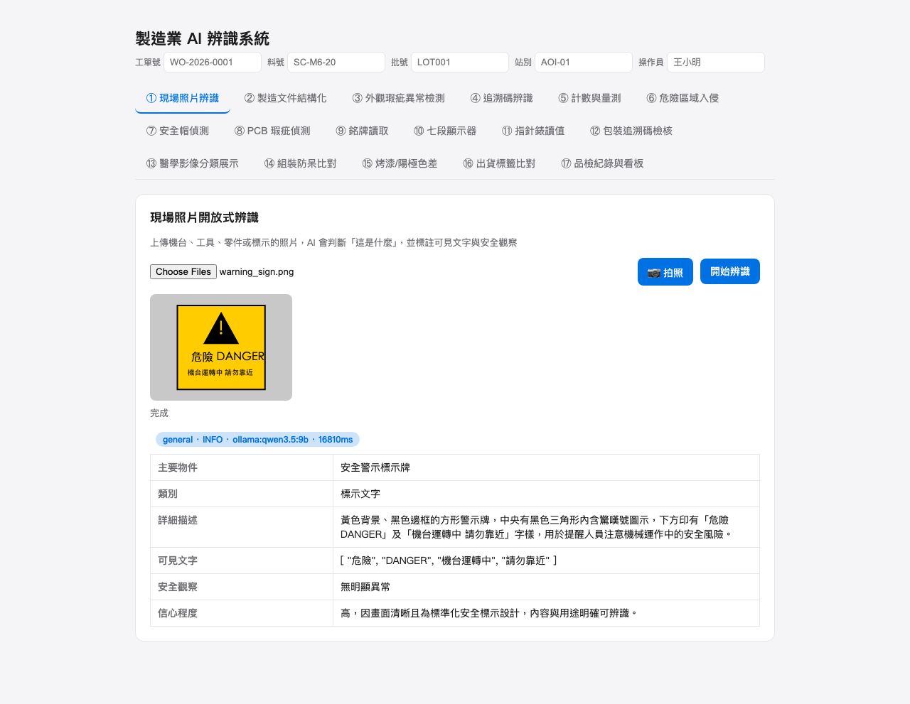 |
| 製造文件結構化 | 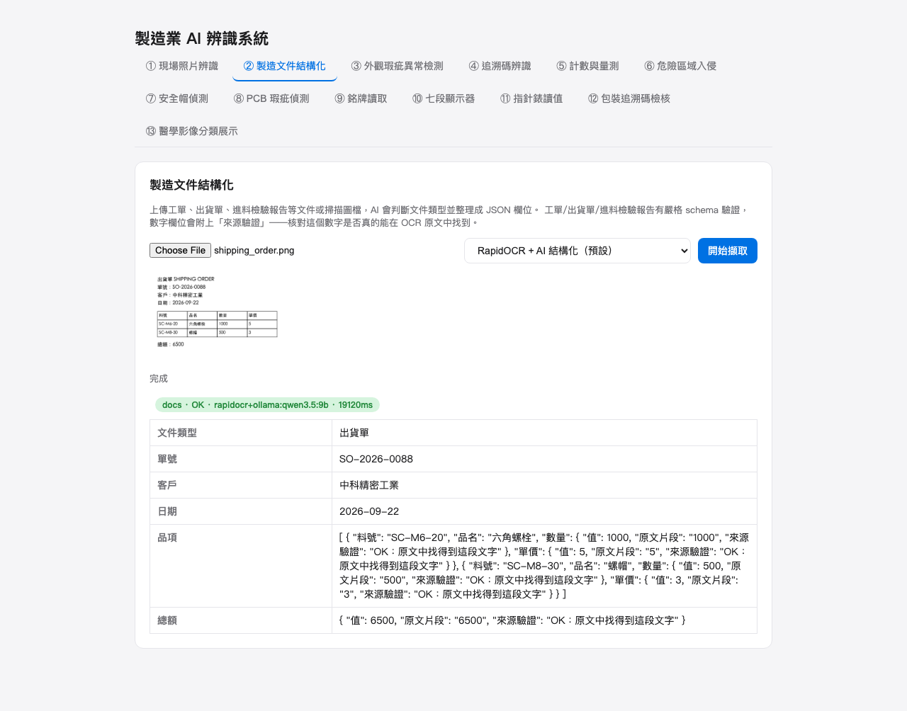 |
| 外觀瑕疵異常檢測 | 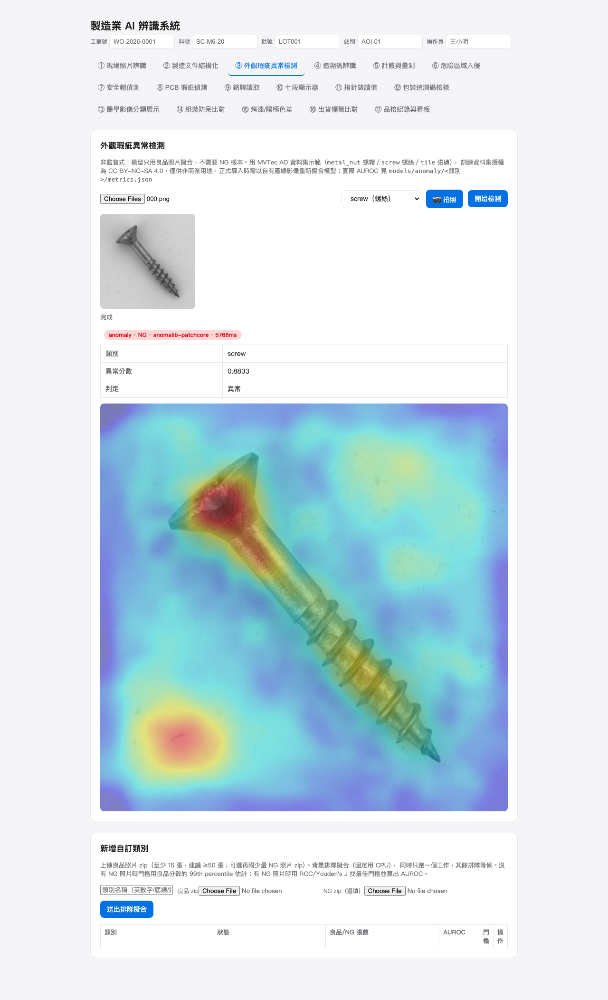 |
| 追溯碼辨識 | 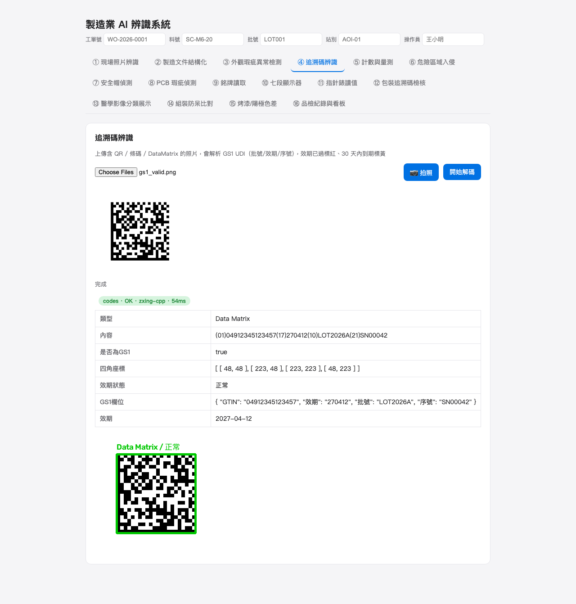 |
| 計數與量測 | 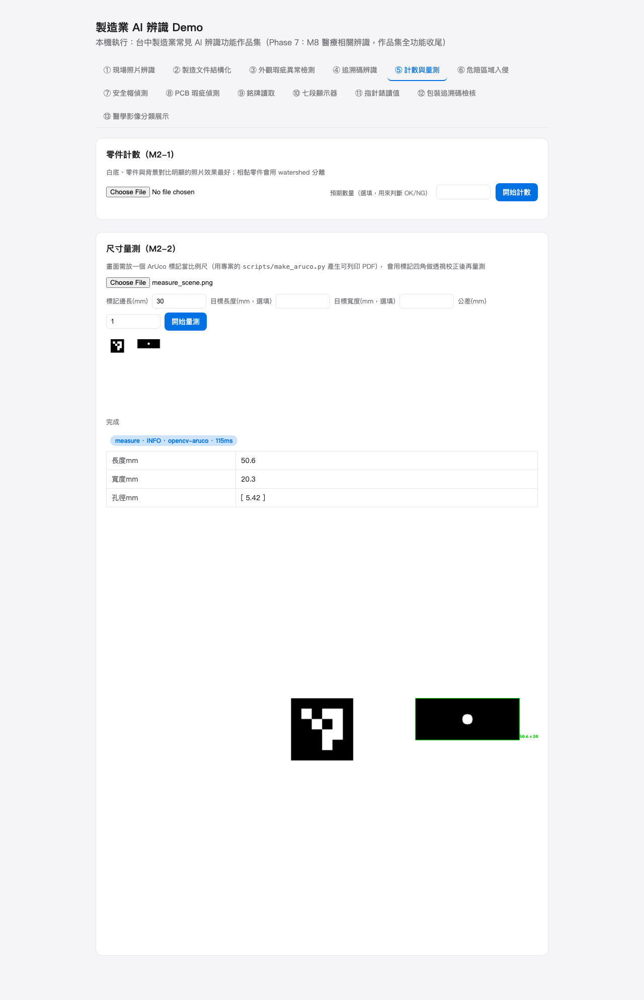 |
| 危險區域入侵 | 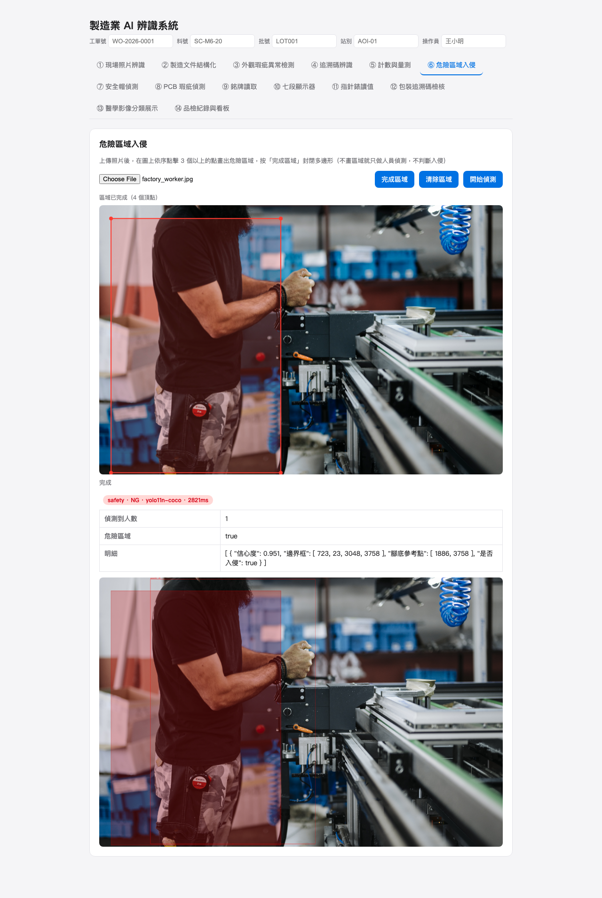 |
| 安全帽偵測 | 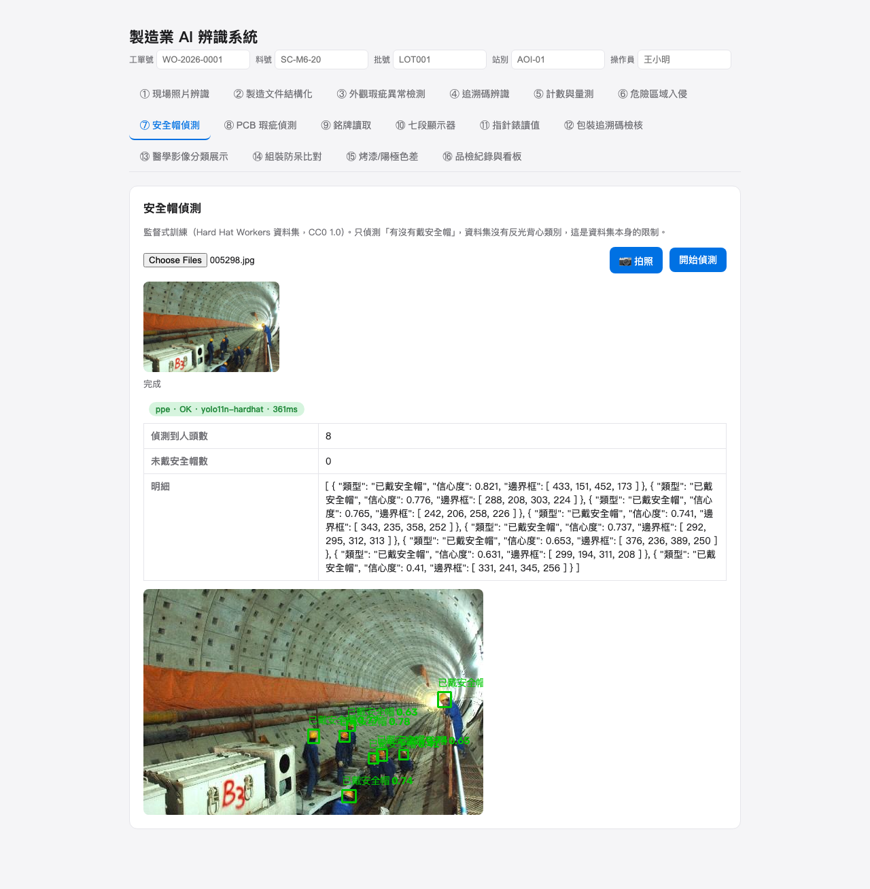 |
| PCB 瑕疵偵測 | 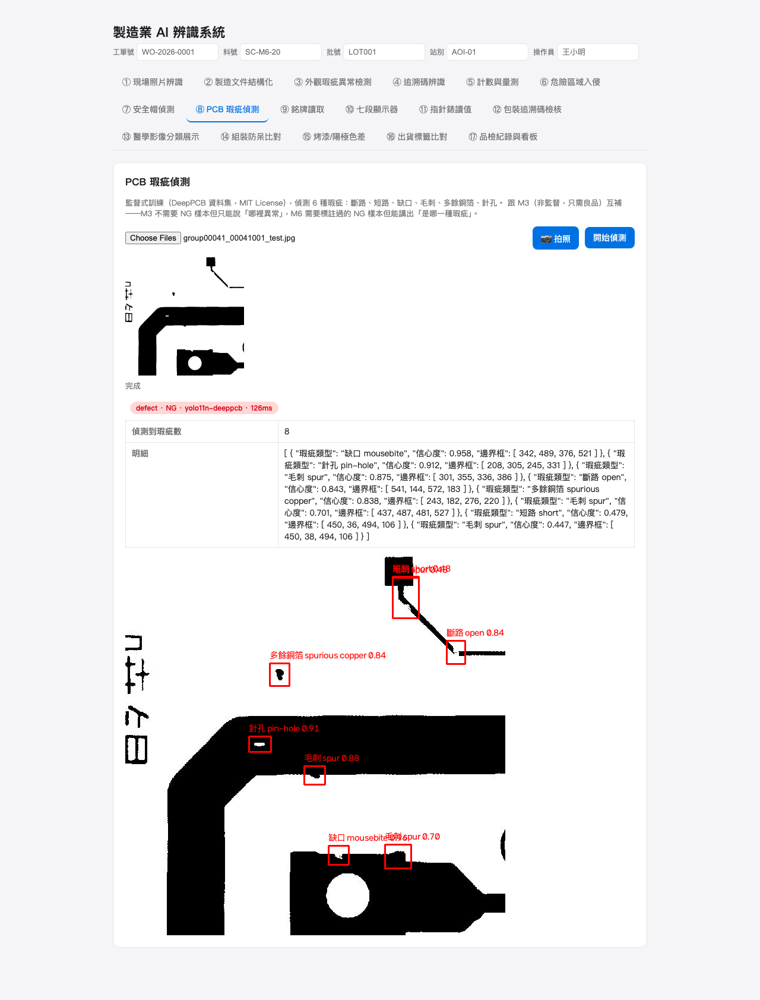 |
| 銘牌讀取 | 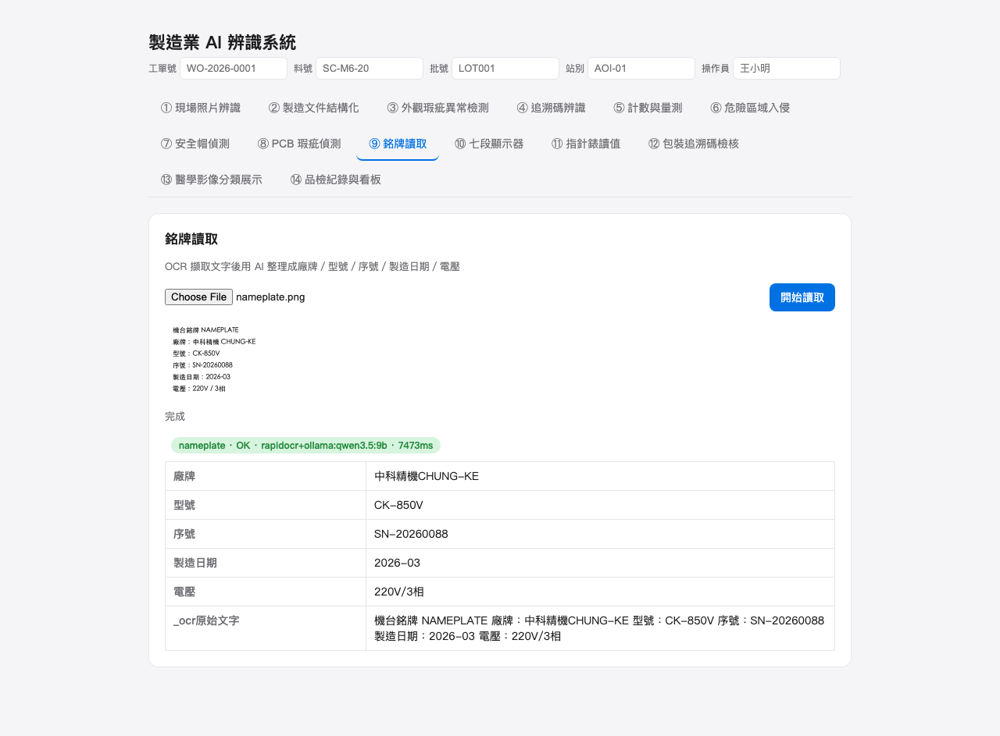 |
| 七段顯示器 | 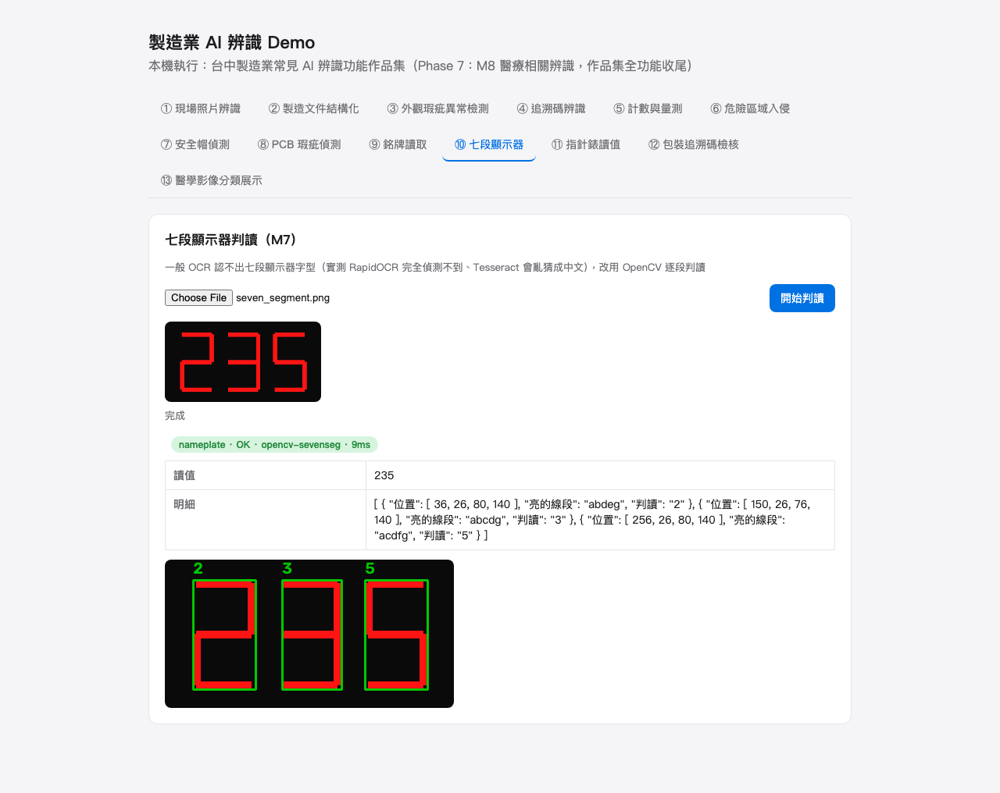 |
| 指針錶讀值 | 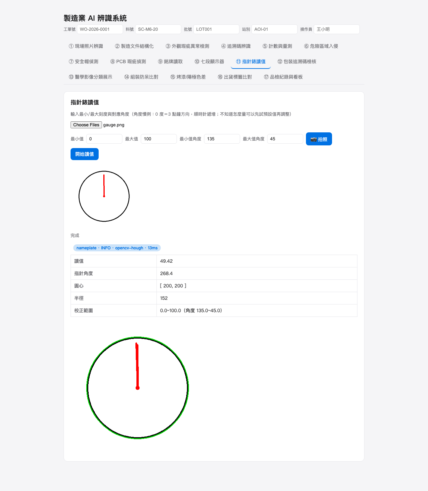 |
| 包裝追溯碼檢核 | 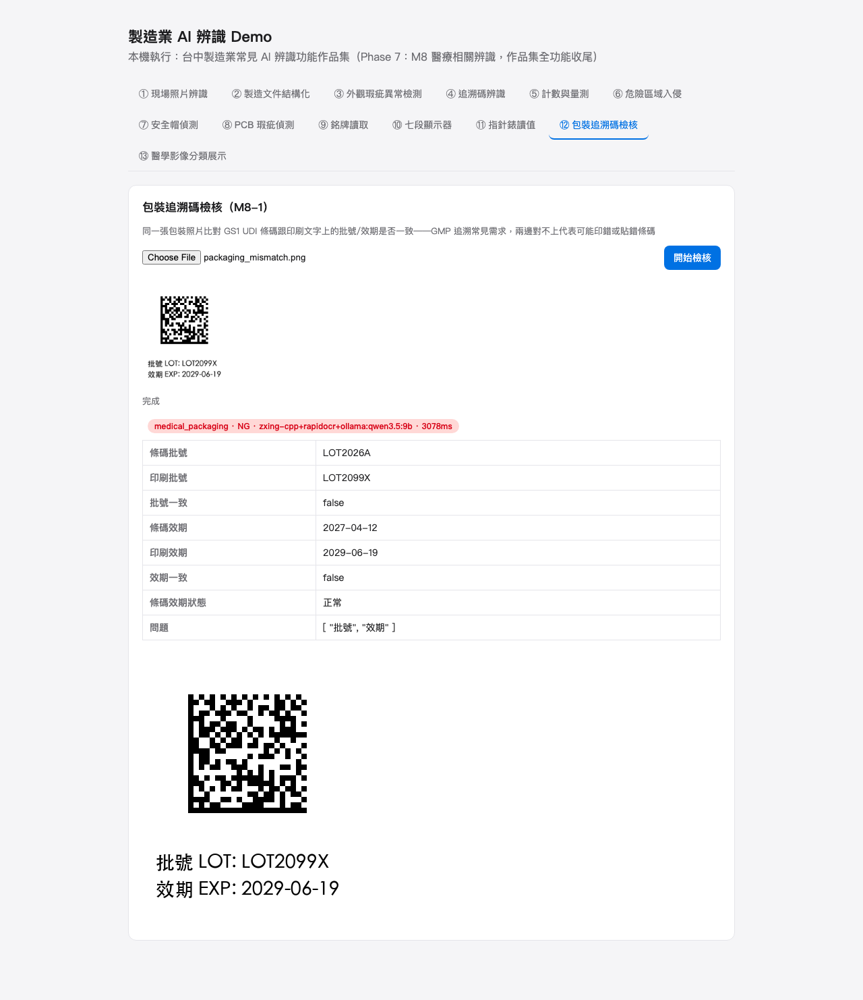 |
| 醫學影像分類展示 | 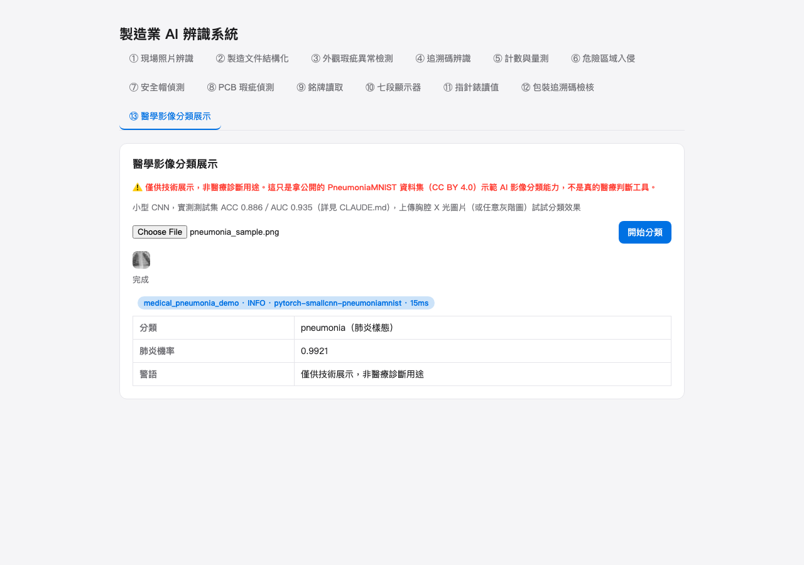 |
| 品檢紀錄與看板 | 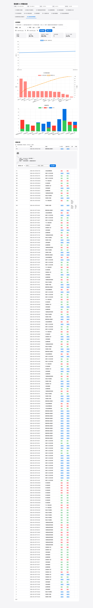 |

重新產生截圖（需先啟動後端，見下方「啟動」）：

```bash
uv pip install -q --python venv/bin/python playwright
venv/bin/python -m playwright install chromium
venv/bin/python scripts/capture_screenshots.py
```

## 未納入功能

依規劃文件 [docs/manufacturing-ai-plan-prompt.md](docs/manufacturing-ai-plan-prompt.md) 的硬性規則「找不到免費方案的功能直接跳過，不寫假的 stub」，以下功能未實作：

- **商用 AOI／機器視覺軟體**（Cognex VisionPro、MVTec HALCON、Keyence）：付費軟體，無免費替代。
- **3D 量測、雷射輪廓、熱影像檢測**：需要專用硬體（3D 掃描儀、雷射輪廓儀、熱像儀），非純軟體可解決。
- **產線高速即時檢測**（工業相機 + PLC 觸發）：需要工業相機與 PLC 硬體整合，本系統目前只做單張圖片辨識。
- **焊道 X 光、刀具磨耗影像**：查證後找不到授權明確的免費公開資料集，不做。
- **振動／聲音預測保養**：不屬於影像辨識範疇，且需要感測器硬體，不在本專案規劃範圍內。
- **Google Cloud Vision／Azure AI Vision**：免費額度有限且需綁信用卡，改用完全免費的本機 Ollama + Gemini 免費層方案。
- **NEU-DET 鋼材表面瑕疵資料集（M6 原規劃選項）**：官方頁面未附任何授權條款（只要求引用論文），查證後授權狀態不明，改用授權明確為 MIT 的 DeepPCB 資料集。

## 安裝

### 1. 系統需求

- macOS（實測於 Apple Silicon M1 Pro，PyTorch 用 CPU／MPS 視模組而定）
- [Homebrew](https://brew.sh)
- [uv](https://github.com/astral-sh/uv)（用來裝 Python 3.11——系統原生沒有這個版本）
- [Ollama](https://ollama.com)

### 2. 系統套件

```bash
brew install tesseract tesseract-lang   # M4 mode=tesseract 比較選項用，非預設路徑（預設是 RapidOCR，Python 套件自動下載模型）
brew install unar                       # 解壓 Hard Hat Workers 資料集的 .rar（M5 PPE 訓練用）
ollama pull qwen3.5:9b                  # M9/M4 預設本機 LLM，約 6.6GB
```

### 3. Python 環境

```bash
git clone https://github.com/thothawei/vision-ai-demo.git
cd vision-ai-demo
uv venv --python 3.11 venv
uv pip install --python venv/bin/python -r backend/requirements.txt
```

### 4. YOLO 權重（M5 危險區域入侵用，免訓練）

```bash
venv/bin/python -c "from ultralytics import YOLO; YOLO('yolo11n.pt')"
mkdir -p models/yolo && mv yolo11n.pt models/yolo/
```

### 5. MVTec AD 資料集 + 擬合異常檢測模型（M3 用，選用）

外觀瑕疵異常檢測需要先擬合模型才能用。資料集下載連結見 [docs/licenses.md](docs/licenses.md)（CC BY-NC-SA 4.0，僅供非商業用途，正式導入需以自有產線影像重新擬合）：

```bash
mkdir -p data/mvtec_ad && cd data/mvtec_ad
curl -sL -o metal_nut.tar.xz "https://www.mydrive.ch/shares/150459/c68856a21dca589b0f8ff6d4ee0f18f4/download/420937637-1629959294/metal_nut.tar.xz" && tar xf metal_nut.tar.xz
curl -sL -o screw.tar.xz "https://www.mydrive.ch/shares/150461/242f454cc6385e5693c4fd4b94567d1e/download/420938130-1629960389/screw.tar.xz" && tar xf screw.tar.xz
curl -sL -o tile.tar.xz "https://www.mydrive.ch/shares/150462/5479f0fdc97bc6fa16eab0cb0cf0109f/download/420938133-1629960456/tile.tar.xz" && tar xf tile.tar.xz
cd ../..
venv/bin/python scripts/train_anomaly.py --category all   # CPU，約 22 分鐘，實測 AUROC 見 CLAUDE.md
```

（連結來自 MVTec 官方下載頁 https://www.mvtec.com/research-teaching/datasets/mvtec-ad/downloads 轉址後的真實網址，若失效請重新到官方頁面查詢。）

### 6. DeepPCB 資料集 + 訓練 M6 瑕疵偵測模型（選用）

```bash
git clone --depth 1 https://github.com/tangsanli5201/DeepPCB.git data/deeppcb
venv/bin/python scripts/prepare_deeppcb.py   # 轉成 YOLO 格式
venv/bin/python -c "
from ultralytics import YOLO
YOLO('yolo11n.pt').train(data='data/deeppcb_yolo/data.yaml', epochs=60, imgsz=640,
    batch=16, device='mps', patience=15,
    project='$(pwd)/models/defect', name='pcb_yolo11n', seed=42)
"   # MPS，實測 32 分鐘（41 epoch early stop），mAP50 0.978
```

沒有 Mac／想用 GPU 更快跑更多 epoch，用 `notebooks/train_pcb_defect.ipynb`（Colab）。

### 7. Hard Hat Workers 資料集 + 訓練 M5 PPE 模型（選用）

```bash
mkdir -p data/hardhat && cd data/hardhat
curl -sL -o Hardhat.rar "https://dataverse.harvard.edu/api/access/datafile/3344658"
unar Hardhat.rar
cd ../..
venv/bin/python scripts/prepare_hardhat.py   # 轉成 YOLO 格式
venv/bin/python -c "
from ultralytics import YOLO
YOLO('yolo11n.pt').train(data='data/hardhat_yolo/data.yaml', epochs=60, imgsz=640,
    batch=16, device='mps', patience=15,
    project='$(pwd)/models/ppe', name='ppe_yolo11n', seed=42)
"   # MPS，實測 4.15 小時（跑滿 60 epoch，沒有提早停止），mAP50 0.977
```

資料集比 M6 大 5 倍，訓練時間長很多；沒時間等就用 `notebooks/train_ppe.ipynb`（Colab GPU）。

**`project` 參數務必用絕對路徑**：`ultralytics` 會把相對路徑的 `project` 加上全域設定的 `runs_dir` 前綴，實際輸出位置會跟你以為的不一樣（踩過的坑，見 CLAUDE.md）。

### 8. M7 七段顯示器／指針錶（免額外安裝）

純 OpenCV，跟前面幾個模組共用同一個 venv，不用另外裝套件或下載資料集。

### 9. M8 醫療相關辨識

M8-1 包裝檢核不用額外安裝（重用 M1 的 zxing-cpp + RapidOCR + LLM）。M8-2 教學展示需要訓練小型分類器：

```bash
venv/bin/python scripts/train_medmnist.py   # 自動下載 PneumoniaMNIST（CC BY 4.0），CPU 約 20 秒
```

### 10.（可選）Gemini 備援

去 [Google AI Studio](https://aistudio.google.com/apikey) 申請免費 API key，複製 `.env.example` 為 `.env` 填入，並把 `LLM_ENGINE` 設成 `gemini`（預設 `ollama`）。免費層限制見下方「已知限制」。

## 啟動

```bash
ollama serve &        # 若尚未執行
source venv/bin/activate
cd backend
uvicorn main:app --reload
```

瀏覽器開 <http://127.0.0.1:8000>，前 13 個分頁各對應一個辨識模組，第 14 個分頁是品檢看板。

畫面最上方的「工單號／料號／批號／站別／操作員」欄位（存 `localStorage`）會自動帶進每次辨識的追溯資訊；`.env` 的 `SAVE_IMAGES`（預設 `true`）控制要不要把每次辨識的原圖與標註圖存到 `data/images/`。

## ERP 串接（`/api/inspections*`）

`/api/inspections*` 需要 `X-API-Key`（`.env` 的 `API_KEYS`，格式 `名稱:key,名稱:key`），13 個辨識端點不用。首次啟動請把 `.env.example` 裡的預設 key（`dev-erp-key-change-me`）換成隨機字串，並同步更新 `frontend/index.html` 的 `FRONTEND_API_KEY` 常數（兩邊要一致，見已知限制）。

完整認證方式、`since_id` 增量輪詢流程（含時序圖）、欄位對照表、C# `HttpClient` 範例，見 [docs/erp-integration.md](docs/erp-integration.md)；即時 API 契約見 `GET /openapi.json`（快照存在 [docs/openapi.json](docs/openapi.json)）。

## 測試

```bash
source venv/bin/activate
python tests/samples/make_samples.py   # 產生測試圖，未進版控
pytest                                  # 單元測試（假 LLM/YOLO/PatchCore），約 10 秒
pytest -m live -s                       # 真打本機模型，需先完成上面的安裝/訓練步驟，約 1-2 分鐘
```

## 已知限制

- **Gemini 免費層速率限制**：`LLM_ENGINE=gemini` 時，`gemini-3.6-flash` 免費層實測 RPM=5、RPD=20，只當備援，不是核心路徑。
- **M2 量測精度**：正視角下實測誤差約 0.3-0.6mm（50mm 零件上約 1%），假設待測物與 ArUco 標記共平面。
- **M3 用 CPU 而非 MPS**：PatchCore 的 coreset 篩選在 MPS 上因逐元素 GPU 同步而變得極慢，固定用 CPU（實測反而更快）。詳見 CLAUDE.md。
- **M4 數字來源核對只在 OCR 模式生效**：端到端模式沒有獨立 OCR 原文可以核對，會誠實標記「無法驗證」而不是假裝驗證過。
- **M5 PPE 只有兩類（helmet/head）**：Hard Hat Workers 資料集本身沒有反光背心類別，是資料集限制。
- **M5 危險區域入侵只做單張圖片**：短影片逐幀抽樣目前還沒做。
- **YOLO 監督式訓練耗時差異大**：M6（1000 張）32 分鐘，M5 PPE（5297 張）在 MPS 上要 4.15 小時；`project` 參數務必用絕對路徑，否則權重會存到意外的位置（見上方安裝步驟）。
- **M7 七段顯示器**：實測 RapidOCR、Tesseract 都認不出七段字型（RapidOCR 偵測不到文字、Tesseract 亂猜成中文），改用 OpenCV 逐段判讀；只在合成測試圖驗證過，真實照片的反光/模糊/歪斜可能影響準確度。
- **M7 指針錶角度校正**：使用者要自己量測 min_angle/max_angle（0 度＝3 點鐘方向，順時針遞增），圓心找不到時要手動輸入；指針落在非量測弧的「死區」會被夾在邊界值，不會報錯提示超出範圍。
- **M8-2 分類準確度**：測試集 ACC=0.8862、AUC=0.9346，normal 召回率只有 74.8%（約每 4 張正常片有 1 張被誤判），這是小型教學用 CNN 的真實表現，不是接近完美的模型——這正是為什麼這個功能反覆強調「僅供技術展示，非醫療診斷用途」。
- **M8-1 包裝檢核只做完全字串/日期相等比對**：OCR 或 LLM 抽取有任何誤差（例如 O/0 混淆）都會被判「不一致」而 NG，需要人工核對細節再判斷。
- **追溯資訊是自由文字，沒有輸入驗證**：工單號/料號等欄位不檢查格式、不比對任何工單主檔（還沒接 ERP），同一工單打錯字會被當成不同工單，篩選查不到。
- **品檢看板的 NG 原因柏拉圖是白名單制**：只有 defect/ppe/anomaly/safety/medical_packaging 五個模組定義了「怎麼抽出缺陷類別」，之後新增模組要記得補上，不然不會出現在柏拉圖。
- **`CORS_ORIGINS` 改 `.env` 要重啟服務才生效**：白名單在啟動時讀死進中介層，不是每個請求動態重讀。
- **API Key 可以用 `?api_key=` query 參數帶**（給 ``／CSV 下載連結用，瀏覽器沒辦法幫這兩種情境帶自訂 header），代價是 key 可能留在瀏覽器歷史紀錄或伺服器 access log，單機無公開網路曝露情境下可接受。
- **webhook 是保底通知，不是唯一真相來源**：`ERP_WEBHOOK_URL` 送出失敗會重試最多 5 次後放棄，ERP 端仍需要自己跑 `since_id` 輪詢當保底。
- 僅供本機 `localhost` 使用，若要手機或外部裝置存取需另外部署。

## 專案結構

```
vision-ai-demo/
├── backend/
│   ├── main.py                 # FastAPI 入口，掛載各模組 router
│   ├── core/                   # 共用回應格式、LLM 抽象層、RapidOCR/Tesseract、七段判讀、指針錶、SQLite 檢驗紀錄、API Key 驗證、webhook
│   ├── schemas/                # M4 文件 schema、M7 銘牌 schema
│   ├── modules/                # general(M9) / docs(M4) / anomaly(M3) / codes(M1) / measure(M2) / safety(M5+PPE) / defect(M6) / nameplate(M7) / medical(M8) / inspections
│   └── requirements.txt
├── frontend/
│   ├── index.html               # 分頁式單頁前端（13 個辨識模組 + 品檢看板）
│   └── vendor/chart.min.js      # Chart.js（MIT），看板圖表用，離線優先不用 CDN
├── scripts/                    # make_aruco.py、train_anomaly.py、prepare_deeppcb.py、prepare_hardhat.py、train_medmnist.py
├── notebooks/                  # train_pcb_defect.ipynb、train_ppe.ipynb（Colab GPU 版訓練）
├── models/                     # 權重，gitignore
├── data/                       # SQLite、資料集（MVTec AD / DeepPCB / Hardhat / MedMNIST），gitignore
├── tests/                      # pytest：單元測試（假模型）+ live 測試（真模型，-m live）
└── docs/                       # 規劃文件、授權查證紀錄、erp-integration.md、openapi.json
```
