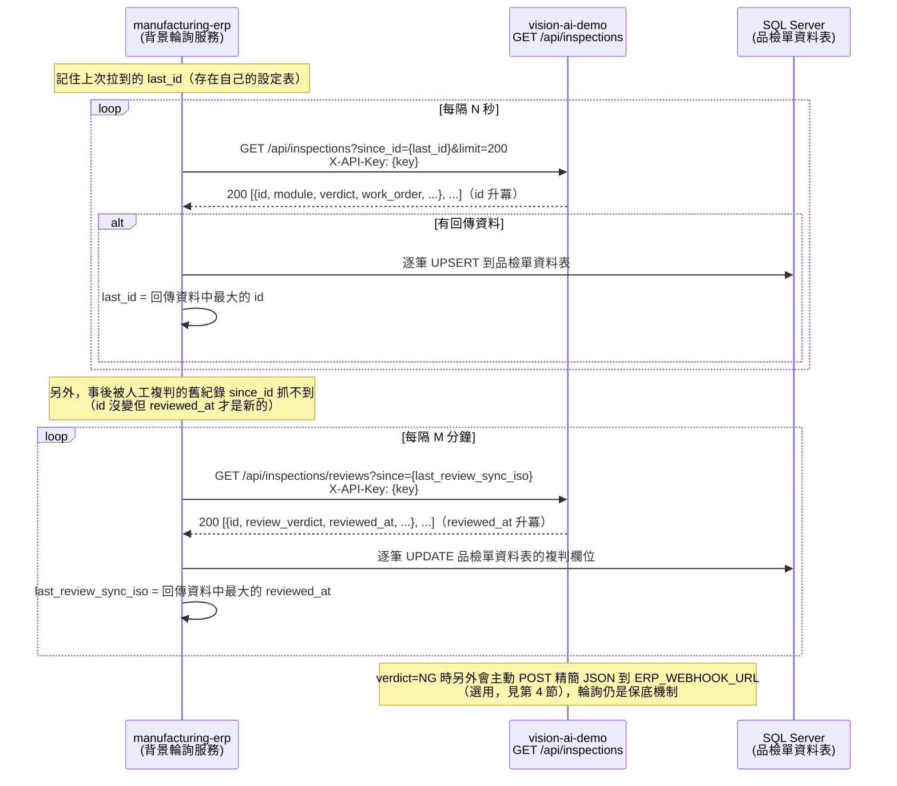

# ERP 串接說明（`manufacturing-erp` 品檢模組用）

本文件給 `manufacturing-erp`（ASP.NET Core + SQL Server）串接 `vision-ai-demo` 檢驗紀錄用。
API 契約見 [openapi.json](openapi.json)（`GET /openapi.json` 即時匯出，跟本文件的欄位對照可能有出入時以它為準）。

## 1. 認證方式

`/api/inspections*` 下的所有端點都需要 `X-API-Key`；本系統其餘 13 個辨識端點（`/api/general/*` 等）不需要，理由見 [CLAUDE.md](../CLAUDE.md)「技術決策與理由（Phase 10）」。

- key 存在 `.env` 的 `API_KEYS=erp:<key>,frontend:<key>`，逗號分隔多組 `名稱:key`。
- 帶法：HTTP header `X-API-Key: <key>`（推薦）；或 URL query `?api_key=<key>`（只給 ``/純連結這種沒辦法帶自訂 header 的情境用，`manufacturing-erp` 走後端輪詢應該一律用 header）。
- 沒帶、帶錯都回 `401 {"detail": "缺少或無效的 X-API-Key"}`。
- **正式導入前務必把 `.env` 的預設 key（`dev-erp-key-change-me`）換成隨機字串**，`API_KEYS` 不進版控（`.gitignore` 已排除 `.env`）。

## 2. 增量輪詢流程（`since_id`）

`GET /api/inspections?since_id=<n>` 只回傳 `id > n` 的紀錄，且排序是 **id 升冪**（沒帶 `since_id` 時預設是 id **降冪**，給前端看板「最新在最上面」用——這是兩種不同用途，ERP 端不要搞混）。



### 端點摘要

| 端點 | 用途 | 排序 |
|---|---|---|
| `GET /api/inspections?since_id=<n>&limit=<m>` | 增量拉取新紀錄 | id **升冪** |
| `GET /api/inspections/reviews?since=<ISO時間>&limit=<m>` | 拉取「事後被複判」的舊紀錄 | `reviewed_at` 升冪 |
| `GET /api/inspections/{id}` | 取單筆完整紀錄 | — |
| `GET /api/inspections/{id}/image?kind=raw\|annotated` | 取原圖／標註圖 | — |
| `GET /api/inspections/export.csv` | 一次性批次匯出 CSV | — |

## 3. 欄位對照表

| 本系統欄位（`inspections` 表 / API 回應） | 型別 | 建議對應的 ERP 品檢單欄位 | 備註 |
|---|---|---|---|
| `id` | int | `VisionInspectionId`（外鍵，唯一） | 增量輪詢的游標依據 |
| `created_at` | ISO 字串 | `InspectedAt` | 本機時間，無時區資訊 |
| `module` | string | `InspectionModule` | 例如 `defect`／`ppe`／`anomaly`，對照表見下方 |
| `verdict` | `OK`\|`NG`\|`INFO` | `AiVerdict` | AI 當下判定，`INFO` 代表非良品/不良品判斷（如開放式辨識） |
| `review_verdict` | `OK`\|`NG`\|null | `FinalVerdict`（null 時退回 `AiVerdict`） | 人工複判結果，`null` 表示尚未複判 |
| `reviewer` / `reviewed_at` / `review_note` | string/ISO/string | `ReviewedBy` / `ReviewedAt` / `ReviewNote` | |
| `work_order` / `part_no` / `lot_no` / `station` / `operator` | string\|null | `WorkOrderNo` / `PartNo` / `LotNo` / `StationCode` / `OperatorName` | 自由文字，Phase 9 起無格式驗證，見已知限制 |
| `engine` | string | `AiEngine` | 例如 `ollama:qwen3.5:9b`、`yolo11n-deeppcb` |
| `elapsed_ms` | int | `InferenceMs` | |
| `summary` | JSON | `RawResultJson`（存成 SQL Server 的 `NVARCHAR(MAX)` 或 `JSON` 型別欄位） | 各模組欄位不同，不建議拆成關聯欄位 |
| `image_path` / `annotated_path` | string\|null | 不直接存，改存 `GET .../image` 的完整 URL | 圖檔留在 vision-ai-demo 這邊，ERP 只存連結 |

### `module` 對照

| module 值 | 中文名稱 |
|---|---|
| `general` | 現場照片辨識 |
| `docs` | 製造文件結構化 |
| `anomaly` | 外觀瑕疵異常檢測 |
| `defect` | PCB 瑕疵偵測 |
| `codes` | 追溯碼辨識 |
| `measure` | 計數與量測 |
| `safety` | 危險區域入侵 |
| `ppe` | 安全帽偵測 |
| `nameplate` | 銘牌／七段顯示器／指針錶 |
| `medical_packaging` | 包裝追溯碼檢核 |
| `medical_pneumonia_demo` | 醫學影像分類展示 |

## 4. 選用 Webhook（NG 即時通知）

`.env` 設定 `ERP_WEBHOOK_URL` 後，每次 `verdict=NG` 會非同步 POST 一份精簡 JSON（背景 thread 送出，不等回應、不擋住辨識 API）：

```json
{
  "inspection_id": 159,
  "module": "defect",
  "verdict": "NG",
  "work_order": "WO-2026-0901",
  "part_no": null,
  "lot_no": null,
  "station": "AOI-02"
}
```

送出失敗（連線失敗、逾時、非 2xx）會寫進本機 SQLite 的 `webhook_queue` 表，由背景執行緒每 30 秒重試一次，最多 5 次後放棄（放棄的紀錄仍保留在表裡，不會自動刪除，方便事後排查）。**這是保底通知，不是唯一真相來源**——ERP 端仍應該跑第 2 節的輪詢當保底，避免 webhook 沒送到（例如 vision-ai-demo 重啟時佇列裡還沒重試完的項目）就漏掉這筆 NG。

## 5. C# 範例：`HttpClient` 輪詢 `since_id` 寫入 SQL Server

```csharp
using System.Net.Http.Json;
using Microsoft.Data.SqlClient;

public record VisionInspection(
    int Id, string CreatedAt, string Module, string Verdict,
    string? ReviewVerdict, string? WorkOrder, string? PartNo,
    string? LotNo, string? Station, string Engine, int ElapsedMs
);

public class VisionPollingService
{
    private readonly HttpClient _http;
    private readonly string _connectionString;
    private int _lastId;

    public VisionPollingService(string baseUrl, string apiKey, string connectionString, int startFromId = 0)
    {
        _http = new HttpClient { BaseAddress = new Uri(baseUrl) };
        _http.DefaultRequestHeaders.Add("X-API-Key", apiKey);
        _connectionString = connectionString;
        _lastId = startFromId;
    }

    public async Task PollOnceAsync(CancellationToken ct = default)
    {
        var url = $"/api/inspections?since_id={_lastId}&limit=200";
        var records = await _http.GetFromJsonAsync<List<VisionInspection>>(url, ct)
                      ?? new List<VisionInspection>();
        if (records.Count == 0) return;

        await using var conn = new SqlConnection(_connectionString);
        await conn.OpenAsync(ct);

        foreach (var r in records)
        {
            const string sql = """
                MERGE dbo.QualityInspections AS target
                USING (SELECT @VisionInspectionId AS VisionInspectionId) AS src
                ON target.VisionInspectionId = src.VisionInspectionId
                WHEN MATCHED THEN UPDATE SET
                    AiVerdict = @AiVerdict, FinalVerdict = @FinalVerdict, InspectedAt = @InspectedAt
                WHEN NOT MATCHED THEN INSERT
                    (VisionInspectionId, InspectionModule, AiVerdict, FinalVerdict,
                     WorkOrderNo, PartNo, LotNo, StationCode, InspectedAt)
                VALUES
                    (@VisionInspectionId, @Module, @AiVerdict, @FinalVerdict,
                     @WorkOrder, @PartNo, @LotNo, @Station, @InspectedAt);
                """;
            // 參數化查詢，避免 SQL injection——不要用字串拼接組 SQL
            await using var cmd = new SqlCommand(sql, conn);
            cmd.Parameters.AddWithValue("@VisionInspectionId", r.Id);
            cmd.Parameters.AddWithValue("@Module", r.Module);
            cmd.Parameters.AddWithValue("@AiVerdict", r.Verdict);
            cmd.Parameters.AddWithValue("@FinalVerdict", (object?)r.ReviewVerdict ?? r.Verdict);
            cmd.Parameters.AddWithValue("@WorkOrder", (object?)r.WorkOrder ?? DBNull.Value);
            cmd.Parameters.AddWithValue("@PartNo", (object?)r.PartNo ?? DBNull.Value);
            cmd.Parameters.AddWithValue("@LotNo", (object?)r.LotNo ?? DBNull.Value);
            cmd.Parameters.AddWithValue("@Station", (object?)r.Station ?? DBNull.Value);
            cmd.Parameters.AddWithValue("@InspectedAt", r.CreatedAt);
            await cmd.ExecuteNonQueryAsync(ct);

            _lastId = Math.Max(_lastId, r.Id);
        }
    }
}
```

上面這段程式碼放在 `docs/erp-integration-sample/` 下用最小可編譯的 console 專案跑過 `dotnet build`（結果見 CLAUDE.md 測試紀錄），SQL Server 連線本身未實際跑過（需要真的 SQL Server 實例），這裡只驗證 C# 語法/型別正確、能編譯成功。

**SQL Server 免費方案**：SQL Server Express（免費、資料庫上限 10GB，足夠品檢紀錄這種規模）或 Developer 版（免費但條款限制只能用於開發/測試，不能正式營運環境）；正式營運環境若要免費，只有 Express 版符合，需注意其大小上限。

## 6. 資安收斂（Phase 10）

- `CORS_ORIGINS`（`.env`，逗號分隔）白名單預設只允許 `http://127.0.0.1:8000,http://localhost:8000`；**這個值只在伺服器啟動時讀一次**，改了 `.env` 要重啟服務才生效，不是即時生效的設定。
- `MAX_UPLOAD_MB`（預設 20）超過回 `413`。
- 不信任副檔名／Content-Type，一律用 Pillow 實際開檔驗證（`core/image_io.load_image()`），假圖片（副檔名 `.png` 但內容不是圖片）回 `400`。
